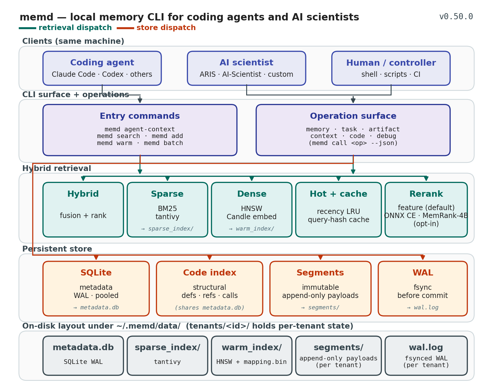

# memd

[](CHANGELOG.md)
[](Cargo.toml)
[](LICENSE)
[](https://fmschulz.github.io/memd/)

`memd` is a local memory CLI for coding agents and AI scientists. Each trusted
machine gets one shared, persistent store: raw searchable content, structured
task history, and canonical collaboration artifacts. A hybrid dense + sparse
stack indexes it; an explicit trust boundary decides what counts as verified.

Agents retrieve bounded context with `memd agent-context` or `memd search`,
read the generated context file, and record durable progress with `memd add`.
For low-latency local use, `memd` keeps the store and indexes hot through a
private CLI-managed warm worker driven by ordinary CLI commands.

**Full documentation: [fmschulz.github.io/memd](https://fmschulz.github.io/memd/)**

## What it does

| Surface | Purpose | Primary CLI commands |
| --- | --- | --- |
| Raw memory | Store and search chunks: code, docs, notes, traces, decisions | `memd add`, `memd search`, `memd get`, `memd stats` |
| Agent context | Bounded pre-work context + JSON audit logs | `memd agent-context --output .memd/context.md` |
| Startup memory | Refresh project `memory.md` with latest project state, ranked fact libraries, and concrete action guidance | `memd memory-md`, `memd eval-memory-md --agent-usefulness` |
| Usefulness report | Usage-ledger and store self-diagnosis for growth, learning, retrieval, and warnings | `memd report --strict` |
| Warm CLI | Keep store/index state hot for repeated local calls | `memd warm start`, `memd warm status` |
| Batch CLI | Many structured operations in one loaded process | `memd batch --jsonl requests.jsonl` |
| Export/import | Manual cross-machine moves through portable OMF | `memd export-omf`, `memd import-omf` |
| Operations | Structured memory/task/artifact/context/code/debug ops | `memd call task.start --json '{...}'` |
| Guardrails | Pin tenant/project scope and verify CLI-first agent wiring | `memd init`, `memd doctor` |

Use `memd search --mode brief_project|resume_task|find_failures|find_decisions|find_evidence|find_highlights`
when retrieval should bias toward persisted digests and canonical summaries.
Use `--compact` and `--token-budget` to keep agent context small.
High-priority durable writes (`priority:8+` or `importance:8+`) must include
a concrete `Agent action:` line. The gate accepts a sentence of at least 24
characters containing an imperative verb (verify, run, use, check, avoid,
prefer, record, treat, ...). Tell the next agent what to verify, run, reuse, or
avoid.

## 30-second quickstart

```bash
git clone --depth 1 https://github.com/fmschulz/memd   # --depth 1: skip 150+ MB of history
cd memd
make install   # prebuilt binary (seconds; compiles only if needed) + skill + enforcement
memd doctor
```

Prebuilt binary only (no clone):

```bash
curl --proto '=https' --tlsv1.2 -LsSf https://github.com/fmschulz/memd/releases/latest/download/memd-installer.sh | sh
```

From source, manual:

```bash
cargo build --release
```

First memory:

```bash
memd add \
  --tenant-id quickstart --project-id auth \
  --chunk-type summary --tags kind:note \
  --text "parseConfig reads TOML and validates required auth fields"

memd search \
  --tenant-id quickstart --project-id auth \
  --query "auth config validation" --compact --token-budget 2000

memd agent-context \
  --tenant-id quickstart --project-id auth \
  --query "auth config validation prior work" \
  --k 2 --token-budget 700 --output .memd/context.md
```

Full walkthrough: [Quick start](https://fmschulz.github.io/memd/quickstart/).

## Architecture



More: [Architecture](https://fmschulz.github.io/memd/architecture/),
[Trust boundary](https://fmschulz.github.io/memd/trust-boundary/),
[Data layout](https://fmschulz.github.io/memd/data-layout/).

## Concurrency model

Writes route through the private warm worker by default (`--warm auto` starts
or reuses it for routable commands), and the worker holds the data-dir
exclusive writer flock for its lifetime; any direct-write fallback or
`--warm off` write takes the same flock with a bounded retry. Reads open the
store in ReadOnly mode without taking the lock or mutating disk, and the worker
probes SQLite `data_version` before each request so direct fallback mutations
are visible before serving. More: [Shared topology](https://fmschulz.github.io/memd/shared-topology/)
and [Operational contract](https://fmschulz.github.io/memd/operational-contract/).

## Benchmark

Retrieval lane comparison on upstream
[`locomo10.json`](https://github.com/snap-stanford/locomo), 10 conversations,
5,882 turns, 1,531 evaluated questions, measured on the released v1.5.0 binary:

| Lane | MRR@10 | Hit@10 | Mean search |
|---|---:|---:|---:|
| hybrid (default) | 0.4762 | 0.6845 | 36.91 ms |
| BM25 only | 0.3375 | 0.5467 | 14.16 ms |
| dense only | 0.3228 | 0.5669 | 32.93 ms |

Hybrid retrieval buys 0.139 MRR@10 over BM25 for roughly 2.6x the search
latency. On code retrieval the ordering is different: dense, adaptive, and
hybrid lanes tie on answer accuracy (73.0%, 72.8%, 72.5%) and each beats BM25
(65.0%). Pick the lane against your own corpus rather than assuming the
default.

Cross-system answer-accuracy comparisons against other memory tools are not
published here. They live in the benchmark repository behind immutable phase
manifests and a verified artifact bundle, because a comparison is only
meaningful when the source commit, binary digest, dataset, answer model, and
judge are pinned for every system. See
[Benchmarking](https://fmschulz.github.io/memd/benchmarking/) for the evidence
contract, the internal release gates, and the reproduction commands.

## Agent skill

The agent skill is the default way to make agents use `memd` through the CLI.

Install the binary, agent skill, and enforcement in one command:

```bash
git clone --depth 1 https://github.com/fmschulz/memd   # --depth 1: skip 150+ MB of history
cd memd
make install   # prebuilt binary (seconds; compiles only if needed) + skill + enforcement
memd doctor
```

Prebuilt binary only (no clone):

```bash
curl --proto '=https' --tlsv1.2 -LsSf https://github.com/fmschulz/memd/releases/latest/download/memd-installer.sh | sh
```

The prebuilt installer installs only the binary. For everything without
compiling, run `make install` from a clone — it tests the prebuilt release
binary and builds from source only if that fails (`make install-prebuilt` is
a kept alias). `make install-source` always builds from source,
`make install-binary` installs only the binary, `make menu` opens an
interactive TUI to pick components, and `make uninstall` removes what
`make install` installed.

For component-target development, `make install-skill` installs the skill as
symlinks. Use `make install-skill-bundle` to copy the current skill plus the
repo-built binary into each unique existing standard skill directory among
`~/.agents/skills`, `~/.claude/skills`, and `~/.codex/skills`.

Run `memd doctor` after installation to verify the binary, data directory,
global rules, SessionStart hook, and current project scope.

More: [Agent skill](https://fmschulz.github.io/memd/agent-skill/),
[Self-improvement loop](https://fmschulz.github.io/memd/self-improvement/).

## Compiled wiki

[`tools/wiki/`](tools/wiki) ships `memd-wiki`, a Python console script that
compiles a Karpathy-style markdown wiki from live `memd` project state
(`index.md`, `log.md`, `projects/<project_id>.md`,
`tasks/<task_id>.md`, `libraries/{failures,decisions,evidence,highlights}.md`).
Pages are trust-aware: they display `trust_tier`, `requires_verification`,
and `grounded_by` links.

```bash
pip install -e tools/wiki/
memd-wiki build
memd-wiki serve
```

More: [Compiled wiki](https://fmschulz.github.io/memd/compiled-wiki/).

## More

- [Quick start](https://fmschulz.github.io/memd/quickstart/)
- [CLI reference](https://fmschulz.github.io/memd/cli-reference/)
- [Configuration](https://fmschulz.github.io/memd/configuration/)
- [OMF — Open Memory Format](https://fmschulz.github.io/memd/omf/)
- [Task-memory schema](https://fmschulz.github.io/memd/scientific-task-memory/schema/)
- [Changelog](CHANGELOG.md)
