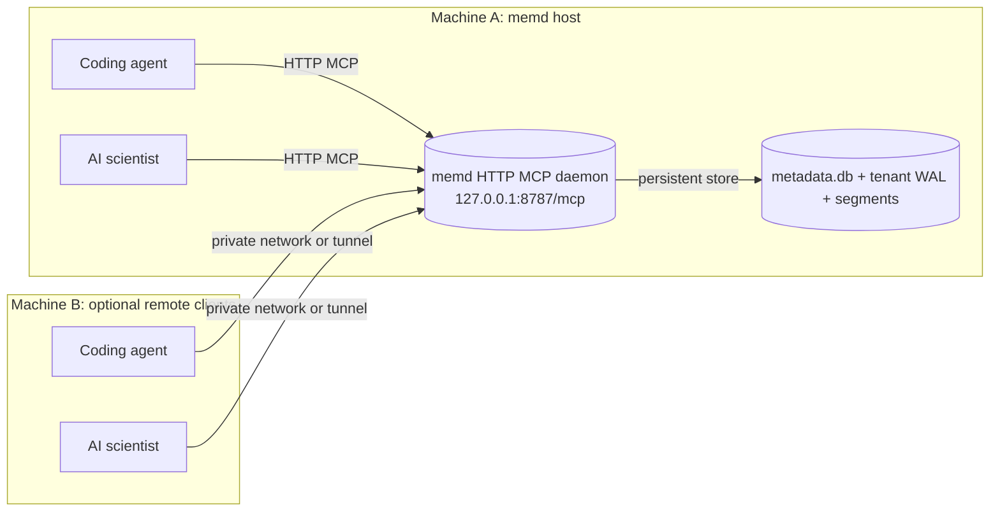

# memd

[](https://github.com/fmschulz/memd/releases/tag/v0.3.0)

`memd` is a local MCP server and shared knowledge base for coding agents and AI scientists.

It does three things:

- stores raw searchable chunks with `memory.*`
- stores structured task history with `task.*`
- stores canonical knowledge artifacts and collaboration threads with `artifact.*`

It also exposes structural code-navigation and debug tools:

- `code.find_definition`
- `code.find_references`
- `code.find_callers`
- `code.find_imports`
- `debug.find_tool_calls`
- `debug.find_errors`

Use `memory.*` for code, docs, notes, and indexed files.

Use `task.*` for work that has:

- a goal
- a reason
- runs and parameters
- evidence
- what worked
- what failed

Use `artifact.*` for collaboration around that work:

- critique and revision
- verification and review state
- shared threads and challenge spaces
- contributor records
- optional safety metadata for local prototypes

For summary-first retrieval and onboarding, `memd` also persists digest artifacts and exposes dedicated briefing and library helpers:

- `context.brief_project`
- `task.resume`
- `artifact.find_failures`
- `artifact.find_decisions`
- `artifact.find_evidence`
- `artifact.find_highlights`

`memory.search`, `task.search`, and `artifact.search` also accept `mode` with `brief_project`, `resume_task`, `find_failures`, `find_decisions`, `find_evidence`, or `find_highlights` to bias retrieval toward those persisted digests and canonical summaries.

Trust boundary:

- `memory.search`, `task.search`, `artifact.search`, and digest helpers are candidate-generation surfaces
- canonical non-digest artifacts are the trust anchor
- persisted digests are compiled hints, not self-authenticating truth
- use `artifact.verify` when a claim must be grounded against canonical artifacts before you trust it

## What You Need

- Rust
- Python 3 for the benchmark scripts

## Build

```bash
cargo build --release
./target/release/memd --version
```

## Run

For a shared local daemon that multiple agent, scientist, or human-guided sessions can use:

```bash
./target/release/memd --mode mcp --transport http --http-bind 127.0.0.1:8787
```

For the legacy stdio subprocess mode:

```bash
./target/release/memd --mode mcp
```

For a throwaway shared-daemon run:

```bash
./target/release/memd --mode mcp --transport http --http-bind 127.0.0.1:8787 --in-memory --data-dir /tmp/memd-demo
```

## Shared Topology

Recommended use is one local `memd` daemon per machine, with multiple coding-agent and AI-scientist sessions connecting to the same `/mcp` endpoint.

```text
+----------------------- Machine A: memd host -----------------------+
| +---------------+   HTTP MCP   +-------------------------------+   |
| | Coding agent  | -----------> |                               |   |
| +---------------+              | memd daemon                   |   |
| +---------------+   HTTP MCP   | 127.0.0.1:8787/mcp           |   |
| | AI scientist  | -----------> |                               |   |
| +---------------+              +---------------+---------------+   |
|                                                |                   |
|                                                | persistent store  |
|                                                v                   |
|                                  +-------------------------------+ |
|                                  | metadata.db                   | |
|                                  | tenants/<tenant>/wal.log      | |
|                                  | tenants/<tenant>/segments/    | |
|                                  | sparse_index/ + warm_index/   | |
|                                  +-------------------------------+ |
+--------------------------------------------------------------------+

+---------------- Machine B: optional remote clients ----------------+
| +---------------+                                  +-------------+ |
| | Coding agent  | -- private network or tunnel --> | same /mcp  | |
| | AI scientist  | -- private network or tunnel --> | endpoint    | |
| +---------------+                                  +-------------+ |
+--------------------------------------------------------------------+
```

Mermaid source for the same topology:



Current boundary conditions:

- same-machine shared sessions are the primary supported path
- cross-machine access is possible by exposing the HTTP endpoint over a private network or tunnel
- `memd` does not yet provide built-in multi-user authentication or server-enforced account isolation
- `tenant_id` is still caller-supplied logical partitioning, not an auth boundary
- on one trusted machine or trust domain, prefer one stable shared `tenant_id` and use `project_id`, `thread_id`, and `task_id` for narrower retrieval scopes
- when `project_id` is supplied, project-scoped retrieval can now widen across other local tenants on the same daemon that already contain that project; this is a compatibility fallback for older fragmented history, not the preferred steady state

## Basic Use

Start a task:

```json
{
  "jsonrpc": "2.0",
  "id": 1,
  "method": "tools/call",
  "params": {
    "name": "task.start",
    "arguments": {
      "tenant_id": "demo",
      "project_id": "auth",
      "goal": "Find the JWT bug",
      "motivation": "Requests are failing in production",
      "hypothesis": "Time handling is inconsistent",
      "scientific_question": "Where does the timestamp skew happen?",
      "expected_outputs": ["root cause", "fix"]
    }
  }
}
```

Then record progress with:

- `task.progress`
- `task.run_start`
- `task.run_finish`
- `task.add_evidence`
- `task.finish`

For digest-backed summaries and summary-first retrieval, use:

- `context.brief_project`
- `task.resume`
- `artifact.find_failures`
- `artifact.find_decisions`
- `artifact.find_evidence`
- `artifact.find_highlights`

`memory.search`, `task.search`, and `artifact.search` also accept `mode` so the same retrieval surfaces can prefer persisted briefs, task resumes, or failure/decision/evidence/highlight libraries when that is the intent.

When `project_id` is supplied, project-scoped retrieval on the shared daemon can also recover same-project history that was previously written under a different local tenant. This reduces continuity loss from older fragmented writes, but future collaborating agents should still use one stable shared `tenant_id`.

For collaboration around the same work, use:

- `artifact.create`
- `artifact.get`
- `artifact.search`
- `artifact.verify`
- `artifact.list_thread`

For raw context, use:

- `memory.add`
- `memory.add_batch`
- `memory.search`

For structural code navigation, index code chunks with a real `source.path`.
Supported code chunks added through `memory.add` or `memory.add_batch` are now
parsed into the structural index when `chunk_type=code` and `source.path` is present.

To refresh project brief and failure/decision/evidence/highlight digests explicitly, call `memory.compact` with `project_id` and, when needed, `digest_modes` plus `force_digest_rebuild`.

When a retrieved summary or search hit matters enough to trust, use the explicit grounded path:

1. `memory.search` / `task.search` / `artifact.search`
2. `artifact.verify`
3. trust the grounded supporting artifact IDs, not the digest text alone

Optional artifact safety metadata is supported through `artifact.create`:

- `compute_budget`
- `cost_actual`
- `data_access_level`
- `policy_tags`
- `allowed_tools`
- `approval_state`

Those fields are optional in the current local prototype.

## Data Location

Persistent mode writes to:

- `metadata.db`
- `tenants/<tenant_id>/wal.log`
- `tenants/<tenant_id>/segments/`
- `tenants/<tenant_id>/warm_index/`
- `sparse_index/`

Default data dir: `~/.memd/data`

## Skill

The agent skill is in [memd-skill](memd-skill).

It now includes a bundled Linux binary at [memd-skill/bin/linux-x64/memd](memd-skill/bin/linux-x64/memd).

Start there if you want agents to use `memd` correctly:

- [memd-skill/SKILL.md](memd-skill/SKILL.md)
- [memd-skill/INSTALL.md](memd-skill/INSTALL.md)

For shared local sessions with current client CLIs:

- start `memd` once with `--transport http`
- register Codex with `codex mcp add memd --url http://127.0.0.1:8787/mcp`
- register Claude with `claude mcp add --transport http --scope user memd http://127.0.0.1:8787/mcp`
- add the instruction snippet from [memd-skill/INSTALL.md](memd-skill/INSTALL.md) to `~/.codex/AGENTS.md` and `~/.claude/CLAUDE.md`

For a stronger default that makes `memd` mandatory for substantive multi-step technical and scientific work:

```bash
./memd-skill/install_memd_enforcement.sh
```

That is the strongest practical enforcement path available without modifying the client binaries themselves.

## Benchmarks

Offline retrieval benchmark:

```bash
./evals/bench/scripts/run_offline_retrieval_benchmark.sh
```

Task-memory benchmark:

```bash
./evals/bench/scripts/run_task_memory_benchmark.sh
```

## Optional ONNX Cross-Encoder

ONNX in this repo is only for the optional cross-encoder reranker.

The default embedding path is still Candle. A normal `cargo build` does not enable ONNX.

Build and run the ONNX reranker path with:

```bash
cargo build --release --features cross-encoder-reranker
./target/release/memd --mode mcp --search-variant hybrid-cross-encoder
```

Runtime behavior:

- `--search-variant hybrid-cross-encoder` selects the ONNX cross-encoder reranker for hybrid search
- the scorer is initialized when the persistent store opens, not lazily on first query
- if the feature is not compiled in, or ONNX initialization fails, `memd` logs a warning and falls back to the feature reranker

Model and runtime assets:

- cross-encoder model: `Xenova/ms-marco-MiniLM-L-6-v2` ONNX
- tokenizer: matching `tokenizer.json`
- ONNX Runtime shared library: downloaded from GitHub releases on supported Linux targets
- default cache dir: `~/.cache/memd/cross-encoder`
- automatic runtime download currently supports `linux/x86_64` and `linux/aarch64`

Useful environment variables:

- `ORT_DYLIB_PATH`
- `MEMD_CROSS_ENCODER_ORT_DYLIB_PATH`
- `MEMD_CROSS_ENCODER_ORT_VERSION`
- `MEMD_CROSS_ENCODER_ORT_URL`
- `MEMD_CROSS_ENCODER_MODEL_PATH`
- `MEMD_CROSS_ENCODER_TOKENIZER_PATH`
- `MEMD_CROSS_ENCODER_CACHE_DIR`
- `MEMD_CROSS_ENCODER_DISABLE=1`

Real ONNX smoke test:

```bash
cargo test -p memd --features cross-encoder-reranker smoke_real_onnx_scores_relevant_pair_higher -- --ignored --nocapture
```

That smoke test calls the ONNX scorer directly, so it does not go through the reranker fallback path.

## More

- [QUICKSTART.md](QUICKSTART.md)
- [docs/scientific-task-memory/schema/README.md](docs/scientific-task-memory/schema/README.md)
- [docs/scientific-task-memory/benchmark-results/README.md](docs/scientific-task-memory/benchmark-results/README.md)
