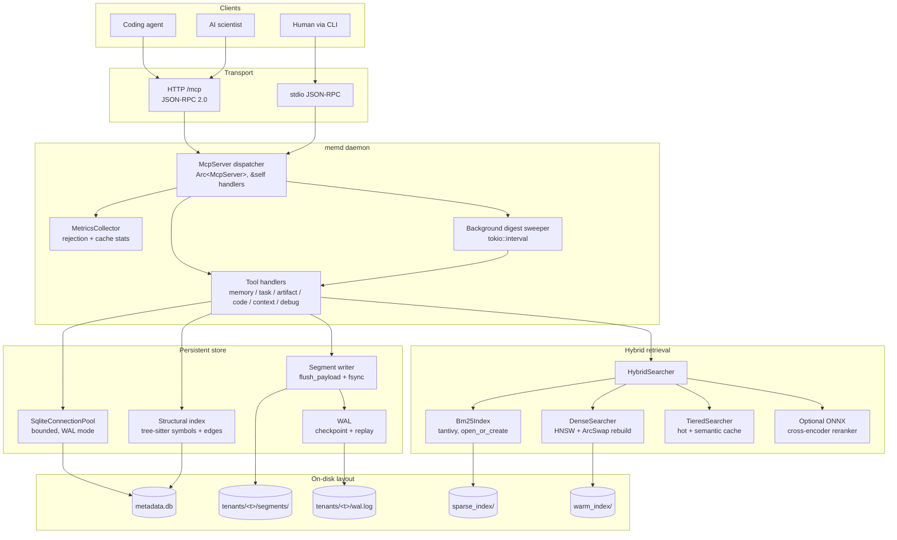
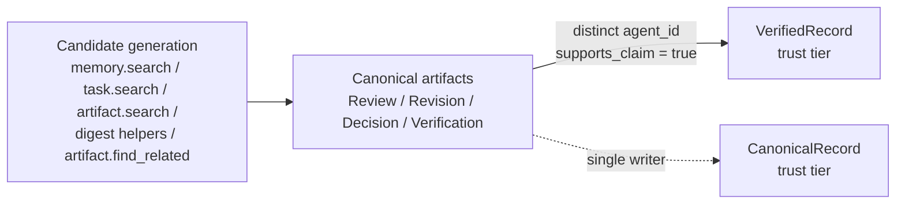
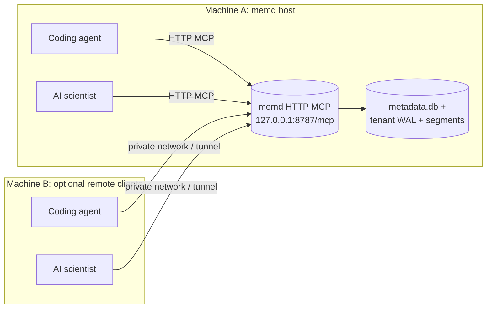

# memd

[](https://github.com/fmschulz/memd/releases/tag/v0.9.0)
[](LICENSE)

`memd` is a local MCP daemon that gives coding agents and AI scientists a single
shared, persistent memory: raw searchable content, structured task history, and
canonical collaboration artifacts — indexed by a hybrid dense + sparse retrieval
stack and gated by an explicit trust boundary.

Every session on the same machine talks to one `memd` over HTTP, so task
context, evidence, decisions, and digests carry across agents, models, and
restarts without copy-paste.

## Contents

- [What it does](#what-it-does)
- [Architecture](#architecture)
- [Quick start](#quick-start)
- [Tool surface](#tool-surface)
- [Trust boundary](#trust-boundary)
- [Shared topology](#shared-topology)
- [Data layout](#data-layout)
- [Configuration](#configuration)
- [Observability](#observability)
- [Benchmarks](#benchmarks)
- [Optional ONNX cross-encoder](#optional-onnx-cross-encoder)
- [Compiled Wiki](#compiled-wiki)
- [Agent skill](#agent-skill)
- [More](#more)

## What it does

| Surface | Purpose | Primary tools |
| --- | --- | --- |
| `memory.*` | Raw searchable chunks (code, docs, notes, indexed files) | `memory.add`, `memory.add_batch`, `memory.search`, `memory.compact` |
| `task.*` | Structured work history: goal, runs, evidence, outcomes | `task.start`, `task.progress`, `task.run_start`, `task.run_finish`, `task.add_evidence`, `task.finish`, `task.resume` |
| `artifact.*` | Canonical collaboration: reviews, revisions, decisions, verifications, threads | `artifact.review`, `artifact.revision`, `artifact.decision`, `artifact.verification`, `artifact.list_thread`, `artifact.find_related` |
| `code.*` | Structural navigation over indexed source | `code.find_definition`, `code.find_references`, `code.find_callers`, `code.find_imports` |
| `context.*` | Summary-first briefing and retrieval | `context.brief_project`, `context.find_relevant_context`, `context.get_hot_context` |
| `debug.*` | Post-hoc session introspection | `debug.find_tool_calls`, `debug.find_errors` |

Use `memory.search`, `task.search`, or `artifact.search` with `mode` set to
`brief_project`, `resume_task`, `find_failures`, `find_decisions`,
`find_evidence`, or `find_highlights` to bias retrieval toward persisted
digests and canonical summaries.

## Architecture



The runtime stack is designed so concurrent MCP requests are not serialized on
a global mutex: handlers dispatch through `Arc<McpServer>` with `&self`, SQLite
is accessed through a bounded connection pool under WAL-mode locking, and HNSW
rebuilds swap atomically without blocking readers.

## Quick start

```bash
cargo build --release
./target/release/memd --version
```

Start the shared local daemon:

```bash
./target/release/memd --mode mcp --transport http --http-bind 127.0.0.1:8787
```

Legacy stdio subprocess mode:

```bash
./target/release/memd --mode mcp
```

Ephemeral run (no persistence):

```bash
./target/release/memd --mode mcp --transport http \
  --http-bind 127.0.0.1:8787 --in-memory --data-dir /tmp/memd-demo
```

Start a task — in v0.4+ only `goal` is required; `tenant_id` falls through
`$MEMD_DEFAULT_TENANT` → `~/.memd/default_tenant` → `"default"`:

```json
{
  "jsonrpc": "2.0",
  "id": 1,
  "method": "tools/call",
  "params": {
    "name": "task.start",
    "arguments": {
      "goal": "Diagnose token validation failures",
      "project_id": "auth"
    }
  }
}
```

A focused artifact tool — `agent_id` is required for distinct-writer
countersignatures:

```json
{
  "jsonrpc": "2.0",
  "id": 2,
  "method": "tools/call",
  "params": {
    "name": "artifact.verification",
    "arguments": {
      "reply_to_artifact_id": "01JABCXYZ...",
      "agent_id": "reviewer-1",
      "summary": "Reproduced the fix; token skew resolved",
      "supports_claim": true
    }
  }
}
```

See [QUICKSTART.md](QUICKSTART.md) for the full walkthrough.

## Tool surface

### `memory.*` — raw searchable content

- `memory.add` — single chunk (code, doc, note; code chunks with a real
  `source.path` are parsed into the structural index)
- `memory.add_batch` — many chunks in one call
- `memory.search` — hybrid retrieval with optional `mode` and `project_id`
- `memory.get`, `memory.delete`, `memory.stats`, `memory.metrics`
- `memory.compact` — explicit digest refresh; supports `digest_modes` and
  `force_digest_rebuild`

### `task.*` — structured work

- `task.start` (only `goal` required), `task.progress`, `task.finish`
- `task.run_start` / `task.run_finish` for substantive runs
- `task.add_evidence` for concrete evidence against a task
- `task.get`, `task.search`, `task.resume`

### `artifact.*` — focused collaboration tools (v0.4)

The single 50-field `artifact.create` has been split into four focused tools
with tight schemas:

- `artifact.review` — request a review; attach summary and requested action
- `artifact.revision` — supersede a prior artifact with `superseded_by` lineage
- `artifact.decision` — choose between alternatives with `why_chosen`
- `artifact.verification` — distinct-writer countersignature; with a different
  `agent_id` than the parent's and `supports_claim = true` it promotes the
  underlying claim to `VerifiedRecord` trust

Inspection and retrieval:

- `artifact.get`, `artifact.search`, `artifact.list_thread`
- `artifact.find_related` (retrieval helper; former `artifact.verify` alias is
  deprecated but still works)
- `artifact.find_failures`, `artifact.find_decisions`, `artifact.find_evidence`,
  `artifact.find_highlights`

`artifact.create` remains registered for backwards compatibility with a
deprecation warning. Digest artifacts are server-generated and cannot be forged
through `artifact.create`.

### `code.*` — structural navigation

`code.find_definition`, `code.find_references`, `code.find_callers`,
`code.find_imports`. Index source by calling `memory.add` with
`type = "code"` and a real `source.path`.

### `context.*` — summary-first retrieval

`context.brief_project`, `context.find_relevant_context`,
`context.get_hot_context`, `context.get_files_for_subsystem`,
`context.list_subsystems`, `context.suggest_agent`.

## Trust boundary



- `memory.search`, `task.search`, `artifact.search`, and digest helpers are
  **candidate-generation surfaces**.
- Canonical non-digest artifacts are the **trust anchor**.
- Persisted digests are **compiled hints**, not self-authenticating truth.
- `artifact.find_related` retrieves canonical artifacts that overlap a claim;
  a retrieval hit is only **supporting evidence**, not trust.
- `VerifiedRecord` trust requires an **independent reviewer with a distinct
  `agent_id`** submitting an `artifact.verification` with `supports_claim =
  true`. A single agent cannot self-label as verified.

## Shared topology

The recommended deployment is one local `memd` per machine, with multiple
coding-agent and AI-scientist sessions connecting to the same `/mcp` endpoint.



Boundary conditions:

- Same-machine shared sessions are the primary supported path.
- Cross-machine access is possible by exposing the HTTP endpoint over a
  private network or tunnel.
- `memd` does **not** provide built-in multi-user authentication or
  server-enforced account isolation.
- `tenant_id` is caller-supplied logical partitioning, **not an authentication
  boundary**. To serve multiple trust domains from one daemon, put the HTTP
  endpoint behind a reverse proxy with real auth (mTLS, OAuth, basic auth) and
  keep one `tenant_id` per trust domain.
- Prefer one stable shared `tenant_id` per trust domain; use `project_id`,
  `thread_id`, and `task_id` for narrower retrieval scopes.
- The legacy cross-tenant `project_id` fallback is **off by default** in
  v0.3.1+. Enable it only when consolidating mis-routed history by setting
  `server.allow_cross_tenant_project_fallback = true`. Every widened hit
  produces a warning log.

## Data layout

Persistent mode writes to:

```
~/.memd/data/
├── metadata.db                       # SQLite metadata (WAL mode, pooled)
├── sparse_index/                     # tantivy BM25 index (open_or_create)
└── tenants/
    └── <tenant_id>/
        ├── wal.log                   # Append-only WAL; fsync before commit
        ├── segments/                 # Immutable chunk segments + payload
        └── warm_index/               # HNSW graph + valid_ids bitmap
```

Default data dir: `~/.memd/data`. Override with `--data-dir`.

## Configuration

Common environment variables:

| Variable | Default | Purpose |
| --- | --- | --- |
| `MEMD_DEFAULT_TENANT` | `default` | Fallback tenant for tool calls without `tenant_id` |
| `MEMD_SQLITE_POOL_MAX` | `16` | Max SQLite connections in the pool |
| `MEMD_DIGEST_SWEEP_INTERVAL_SEC` | `10` | Background digest-sweeper interval; `0` disables |
| `MEMD_CROSS_ENCODER_DISABLE` | unset | When `1`, skip ONNX cross-encoder init |
| `ORT_DYLIB_PATH` | unset | Override ONNX Runtime shared library location |

Config file: `~/.memd/config.toml`. Notable keys:

```toml
[server]
allow_cross_tenant_project_fallback = false   # off by default in v0.3.1+

[retrieval]
search_variant = "hybrid"                     # or "hybrid-cross-encoder"
```

## Observability

- `memory.metrics` surfaces per-tool, per-reason rejection counts, cache hit
  rates, and HNSW state snapshots.
- Every rejected tool call increments `MetricsCollector::record_rejection`.
- `tracing` subscriber emits structured JSON logs when `RUST_LOG` is set.
- Deprecation warnings for `artifact.create` (mega-schema),
  `context.search_context_documents`, and the `artifact.verify` alias log at
  `warn!` level so migration can be tracked.

## Benchmarks

Offline retrieval benchmark:

```bash
./evals/bench/scripts/run_offline_retrieval_benchmark.sh
```

Task-memory benchmark (projection write-amplification, retrieval latency):

```bash
./evals/bench/scripts/run_task_memory_benchmark.sh
```

## Optional ONNX cross-encoder

ONNX in this repo is **only** for the optional cross-encoder reranker. The
default embedding path is Candle; a normal `cargo build` does not enable ONNX.

```bash
cargo build --release --features cross-encoder-reranker
./target/release/memd --mode mcp --search-variant hybrid-cross-encoder
```

Runtime behaviour:

- `--search-variant hybrid-cross-encoder` selects the ONNX reranker for hybrid
  search.
- The scorer is initialized when the persistent store opens, not lazily on
  first query.
- If the feature is not compiled in, or ONNX initialization fails, `memd`
  logs a warning and falls back to the feature reranker.

Model and runtime assets:

- Cross-encoder model: `Xenova/ms-marco-MiniLM-L-6-v2` ONNX
- Tokenizer: matching `tokenizer.json`
- ONNX Runtime shared library: downloaded from GitHub releases on supported
  targets (`linux/x86_64`, `linux/aarch64`)
- Default cache dir: `~/.cache/memd/cross-encoder`

Real ONNX smoke test (requires network on first run):

```bash
cargo test -p memd --features cross-encoder-reranker \
  smoke_real_onnx_scores_relevant_pair_higher -- --ignored --nocapture
```

## Compiled Wiki

[`tools/wiki/`](tools/wiki) ships `memd-wiki`, a Python console script
that compiles a Karpathy-style markdown wiki from live `memd` project
state through the MCP HTTP API. Pages include `index.md`, `log.md`,
`projects/<project_id>.md`, `tasks/<task_id>.md`, and
`libraries/{failures,decisions,evidence,highlights}.md`, each
trust-aware (displays `trust_tier`, `requires_verification`, and
`grounded_by` links).

Install (stdlib-only, Python ≥ 3.11):

```bash
pip install -e tools/wiki/
memd-wiki build
memd-wiki lint
```

`memd-wiki` is version-aligned with the `memd` binary it talks to
(MAJOR.MINOR must match; patch skew warns). See
[`tools/wiki/README.md`](tools/wiki/README.md) for install paths,
`.memd/config.json` `wiki` subsection, containment guard, determinism
contract, and the 5-check lint table.

## Agent skill

The agent skill lives in [memd-skill](memd-skill). It ships with a bundled
Linux binary at [memd-skill/bin/linux-x64/memd](memd-skill/bin/linux-x64/memd).

Start here to have agents use `memd` correctly:

- [memd-skill/SKILL.md](memd-skill/SKILL.md)
- [memd-skill/INSTALL.md](memd-skill/INSTALL.md)

For shared local sessions with current client CLIs:

```bash
codex mcp add memd --url http://127.0.0.1:8787/mcp
claude mcp add --transport http --scope user memd http://127.0.0.1:8787/mcp
```

Add the instruction snippet from `INSTALL.md` to `~/.codex/AGENTS.md` and
`~/.claude/CLAUDE.md` so agents consistently consult and record into `memd`
during substantive work.

For a stronger default that makes `memd` mandatory for substantive multi-step
technical and scientific work:

```bash
./memd-skill/install_memd_enforcement.sh
```

This also injects a pre-refusal rule: agents must check `memd` before
declaring a task impossible, blocked, or unknowable. For one-shot runs you can
install runtime refusal guards — `codex-memd-guard` (for `codex exec`-style
runs) and `claude-memd-guard` (for `claude -p` / `--print` runs). Set
`MEMD_URL` and `MEMD_GUARD_TENANT_ID` when the audited endpoint or tenant is
not the default local setup.

## More

- [QUICKSTART.md](QUICKSTART.md)
- [CHANGELOG.md](CHANGELOG.md)
- [docs/scientific-task-memory/schema/README.md](docs/scientific-task-memory/schema/README.md)
- [docs/scientific-task-memory/benchmark-results/README.md](docs/scientific-task-memory/benchmark-results/README.md)
