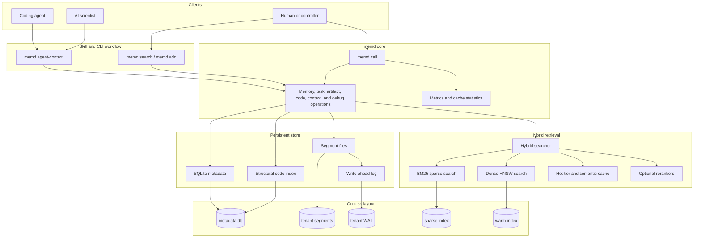
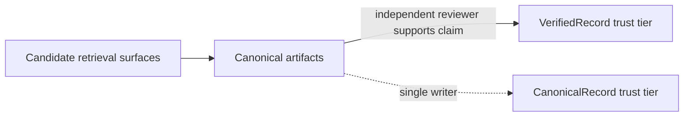
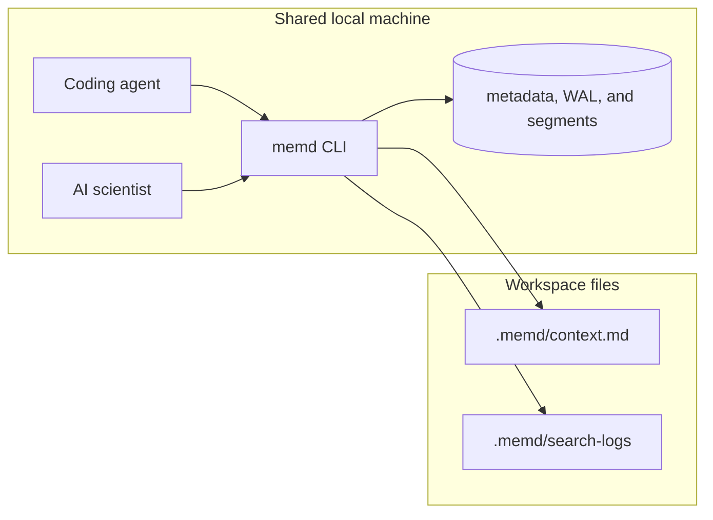

# memd

[](CHANGELOG.md)
[](Cargo.toml)
[](LICENSE)

`memd` is a local memory CLI that gives coding agents and AI scientists a
single shared, persistent memory: raw searchable content, structured task
history, and canonical collaboration artifacts, indexed by a hybrid dense +
sparse retrieval stack and gated by an explicit trust boundary.

The main workflow is skill + CLI. Agents retrieve bounded context with
`memd agent-context` or `memd search`, read the generated context file, and
record durable progress with `memd add`. Former tool-style operations remain
available through `memd call <operation> --json ...`; they no longer require an
agent-visible integration layer. For low-latency local use, `memd` can keep the
store and indexes hot through a private CLI-managed warm worker; this is a
background process driven through ordinary CLI commands.

## Contents

- [What it does](#what-it-does)
- [Architecture](#architecture)
- [Quick start](#quick-start)
- [CLI surface](#cli-surface)
- [Self-Improvement Loop](#self-improvement-loop)
- [Local operation surface](#local-operation-surface)
- [Trust boundary](#trust-boundary)
- [Shared topology](#shared-topology)
- [Data layout](#data-layout)
- [Configuration](#configuration)
- [Observability](#observability)
- [Benchmarking Overview](#benchmarking-overview)
- [Optional ONNX cross-encoder](#optional-onnx-cross-encoder)
- [Optional MemReranker-4B](#optional-memreranker-4b)
- [Compiled Wiki](#compiled-wiki)
- [Agent skill](#agent-skill)
- [More](#more)

## What it does

| Surface | Purpose | Primary CLI commands |
| --- | --- | --- |
| Raw memory | Store and search chunks such as code, docs, notes, traces, and decisions | `memd add`, `memd search`, `memd get`, `memd delete`, `memd stats` |
| Agent context | Build bounded pre-work context and JSON audit logs | `memd agent-context --output .memd/context.md --log-dir .memd/search-logs` |
| Warm CLI | Keep persistent store/index state hot for repeated local calls | `memd warm start`, `memd warm status`, `--warm required` |
| Batch CLI | Run many structured operations in one loaded process | `memd batch --jsonl requests.jsonl`, `memd batch --jsonl - --stream` |
| Export/import | Move local memory to portable formats | `memd export`, `memd export-markdown`, `memd export-omf`, `memd import-omf` |
| Operation parity | Invoke structured memory/task/artifact/context/code/debug operations locally | `memd call task.start --json '{"tenant_id":"t","goal":"..."}'` |
| Guardrails | Pin tenant/project scope and CLI-first agent rules | `memd init` |

Use `memd search --mode brief-project|resume-task|find-failures|find-decisions|find-evidence|find-highlights`
when retrieval should bias toward persisted digests and canonical summaries.
Use `--compact` and `--token-budget` to keep agent context small.

## Architecture



The runtime stack is designed so direct CLI commands and local operation calls
share the same storage, retrieval, and artifact machinery. SQLite is accessed
through a bounded connection pool under WAL-mode locking, and HNSW rebuilds
swap atomically without blocking readers.

## Quick start

```bash
cargo build --release
./target/release/memd --version
```

Add and search memory from the CLI:

```bash
./target/release/memd add \
  --tenant-id quickstart \
  --project-id auth \
  --chunk-type summary \
  --tags kind:note,source:quickstart \
  --text "parseConfig reads TOML and validates required auth fields"

./target/release/memd search \
  --tenant-id quickstart \
  --project-id auth \
  --query "auth config validation" \
  --compact \
  --token-budget 2000 \
  --format markdown
```

Build bounded context for an agent:

```bash
./target/release/memd agent-context \
  --tenant-id quickstart \
  --project-id auth \
  --query "auth config validation prior work" \
  --k 2 \
  --token-budget 700 \
  --format markdown \
  --output .memd/context.md \
  --log-dir .memd/search-logs
```

Keep the same CLI path hot for repeated calls:

```bash
./target/release/memd warm start
./target/release/memd agent-context --warm required \
  --tenant-id quickstart \
  --project-id auth \
  --query "auth config validation prior work" \
  --output .memd/context.md
./target/release/memd warm stop
```

Run structured operations in one process from JSONL:

```bash
printf '%s\n' \
  '{"tool":"task.start","arguments":{"tenant_id":"quickstart","project_id":"auth","goal":"capture auth validation evidence"}}' \
  | ./target/release/memd batch --jsonl -
```

Initialize CLI guardrails in a repository:

```bash
./target/release/memd init --tenant-id quickstart --project-id auth
```

Invoke structured task/artifact operations locally when a first-class CLI
command would be too narrow:

```bash
./target/release/memd call task.start \
  --json '{"tenant_id":"quickstart","project_id":"auth","goal":"capture auth validation evidence"}'
```

See [QUICKSTART.md](QUICKSTART.md) for the full CLI walkthrough.

## CLI Surface

The default agent-facing commands are:

- `memd agent-context` — prefetch bounded context to a file with audit logs.
- `memd search` — direct compact search.
- `memd add` — store summaries, traces, evidence, and decisions.
- `memd warm start|status|stop` — manage the private local warm worker used by
  `--warm auto|required`.
- `memd batch --jsonl` — run structured operation calls from JSONL in one
  loaded process; `--stream` keeps stdin/stdout open for benchmark clients.
- `memd get`, `memd delete`, `memd stats` — inspect and maintain chunks.
- `memd export`, `memd export-markdown`, `memd export-omf`, `memd import-omf`
  — portable local memory operations.
- `memd init` — write `.memd/` scope files and CLI guardrail blocks.
- `memd memory-md` — refresh project-root `memory.md` with the strongest
  takeaways for session-start use; pass `--cross-tenant` to add a
  Cross-Tenant Takeaways section sourced from
  `kind:consolidated, priority>=8` chunks across other tenants.
- `memd consolidate` — call the configured LLM (Claude Haiku or Codex
  Spark, selected by `MEMD_CONSOLIDATOR`) to rewrite recent chunks into
  deduplicated `kind:consolidated` lessons. Sources are soft-tombstoned
  via `ChunkStatus::Superseded` (never deleted). Add
  `--promote-to-shared` to copy multi-project lessons into the
  `MEMD_SHARED_TENANT` tenant for cross-project transfer.
- `memd session-start` — refresh `memory.md` synchronously, then spawn a
  background consolidation when enough chunks have accumulated. Wired
  into Claude Code via the bundled skill installer; a Codex hook
  template lives at `memd-skill/examples/codex_session_start_hook.json`.
- `memd eval-counterfactual` — replay a JSONL benchmark file, write an
  overlap@k / rank-shift report under `evals/bench/reports/`. Used to
  monitor whether `kind:consolidated` lessons are load-bearing in
  retrieval.

## Self-Improvement Loop

`memd` keeps the working set of takeaways durable and useful across
sessions through four cooperating mechanisms — each is independent and
can be inspected in isolation:

1. **Heuristic priority at write time.** `memd add` (and the MCP
   `memory.add` handler) stamp a `priority:N` tag (3..=7) inferred from
   the chunk's `ChunkType`, `kind:*` tags, and validation/finish text
   signals. Explicit user `priority:` / `importance:` tags always win on
   overlap. This makes the `priority_score` formula in `memory.md` fire
   without requiring agents to tag every write.
2. **LLM consolidation.** `memd consolidate` builds a working region
   from chunks written/retrieved since the last run, asks the
   configured backend (`MEMD_CONSOLIDATOR=claude|codex|auto|mock`) to
   rewrite them into deduplicated `kind:consolidated` lessons with
   `supersedes:<csv>` provenance, and soft-tombstones the sources. The
   prompt frames untrusted chunk text as a JSON array (so chunks cannot
   forge instructions), runs under a single timeout that reaps zombie
   subprocesses on expiry, and globally dedupes `supersedes` claims so
   the same source can never be claimed twice.
3. **Retrieval-success signal.** Every CLI search appends one JSONL
   record per returned chunk to `.memd/data/hit_counts.jsonl`; the
   `memory.md` priority formula consumes a per-chunk 30-day aggregate
   (1 h TTL cache) — frequently-retrieved chunks get up to +8, chunks
   with no hits older than 30 days get −2. `memd eval-counterfactual`
   measures whether the `kind:consolidated` chunks are actually
   moving ranks vs. a same-pass filtered baseline.
4. **Cross-tenant transfer.** Opt-in via `memory-md --cross-tenant` and
   `consolidate --promote-to-shared`: lessons that recur across
   projects can be hoisted to a shared tenant, deduped, and surfaced
   in every project's `memory.md` without copying private context.
   Promotions are idempotent under a deterministic `provenance:<sha8>`
   tag.

The session-start hook (`memd session-start --project-dir
"$CLAUDE_PROJECT_DIR"`) ties everything together: it refreshes
`memory.md` synchronously, then kicks a background `memd consolidate`
when ≥ 10 dirty chunks have accumulated.

## Local Operation Surface

`memd call <operation> --json ...` exposes the historical operation surface
through the executable, without starting a separate integration process. This is the
compatibility path for advanced scripts that need structured task, artifact,
context, code, or debug operations before every operation gets a dedicated
first-class subcommand.

### `memory.*` — raw searchable content

- `memory.add` — single chunk (code, doc, note; code chunks with a real
  `source.path` are parsed into the structural index)
- `memory.add_batch` — many chunks in one call
- `memory.search` — hybrid retrieval with optional `mode`, `project_id`,
  compact/token-budgeted output, and event sibling expansion
- `memory.get`, `memory.delete`, `memory.stats`, `memory.health`,
  `memory.metrics`
- `memory.compact` — explicit digest refresh; supports `digest_modes` and
  `force_digest_rebuild`
- `memory.dream` — dry-run-first retention and compaction planning; safely
  retires duplicate digest projections on apply and writes a traceable report.
  Exact duplicate raw chunks are reported by health, but are not auto-retired
  by the safe profile.

Conversation-style chunks can carry caller-supplied `event:<id>` tags along
with `entry:factual` or `entry:relational`. Passing
`expand_event_siblings: true` to `memory.search` keeps the ranked result list
unchanged and attaches bounded same-tenant/same-project chunks that share the
matched event tag under each result's `expanded_siblings` field.

### `task.*` — structured work

- `task.start` (only `goal` required), `task.progress`, `task.finish`
- `task.run_start` / `task.run_finish` for substantive runs
- `task.add_evidence` for concrete evidence against a task
- `task.get`, `task.search`, `task.resume`

### `artifact.*` — focused collaboration tools (v0.4)

The single 50-field `artifact.create` has been split into four focused tools
with tight schemas:

- `artifact.review` — request a review; attach summary and requested action
- `artifact.revision` — supersede a prior artifact with `superseded_by` lineage
- `artifact.decision` — choose between alternatives with `why_chosen`
- `artifact.verification` — distinct-writer countersignature; with a different
  `agent_id` than the parent's and `supports_claim = true` it promotes the
  underlying claim to `VerifiedRecord` trust

Inspection and retrieval:

- `artifact.get`, `artifact.search`, `artifact.list_thread`
- `artifact.find_related` (retrieval helper; former `artifact.verify` alias is
  deprecated but still works)
- `artifact.find_failures`, `artifact.find_decisions`, `artifact.find_evidence`,
  `artifact.find_highlights`

`artifact.create` remains available for backwards compatibility with a
deprecation warning. Digest artifacts are system-generated and cannot be forged
through `artifact.create`.

`artifact.search` defaults to the full legacy response. Passing `compact: true`
adds `budget_info`; `include_artifact: false` and `include_matched_text: false`
return only identifiers, summaries, ranking, and trust/grounding metadata so a
caller can fetch selected records with `artifact.get`.

### `code.*` — structural navigation

`code.find_definition`, `code.find_references`, `code.find_callers`,
`code.find_imports`. Index source by calling `memory.add` with
`type = "code"` and a real `source.path`.

### `context.*` — summary-first retrieval

`context.brief_project`, `context.find_relevant_context`,
`context.get_hot_context`, `context.get_files_for_subsystem`,
`context.list_subsystems`, `context.suggest_agent`.

`context.find_relevant_context` can prepend hot-context chunks when
`include_hot` is true. That legacy hot pre-scan is bounded by a short
wall-clock budget so large tenants still fall through to normal retrieval
instead of blocking the whole lookup on a full payload scan.

## Trust boundary



- `memory.search`, `task.search`, `artifact.search`, and digest helpers are
  **candidate-generation surfaces**.
- Canonical non-digest artifacts are the **trust anchor**.
- Persisted digests are **compiled hints**, not self-authenticating truth.
- `artifact.find_related` retrieves canonical artifacts that overlap a claim;
  a retrieval hit is only **supporting evidence**, not trust.
- `VerifiedRecord` trust requires an **independent reviewer with a distinct
  `agent_id`** submitting an `artifact.verification` with `supports_claim =
  true`. A single agent cannot self-label as verified.

## Shared topology

The recommended deployment is one shared local data directory per trusted
machine or trust domain, with multiple coding-agent and AI-scientist sessions
using the same `memd` CLI binary and tenant/project conventions.



Boundary conditions:

- Same-machine shared sessions through the CLI are the primary supported path.
- `memd` does **not** provide built-in multi-user authentication or
  account isolation.
- `tenant_id` is caller-supplied logical partitioning, **not an authentication
  boundary**. Keep separate trust domains in separate data directories or under
  explicit tenant conventions.
- Prefer one stable shared `tenant_id` per trust domain; use `project_id`,
  `thread_id`, and `task_id` for narrower retrieval scopes.
- Cross-tenant project aliasing is **off by default**. Enable it only when
  consolidating mis-routed history; every widened hit produces a warning log.

## Data layout

Persistent mode writes to:

```
~/.memd/data/
├── metadata.db                       # SQLite metadata (WAL mode, pooled)
├── sparse_index/                     # tantivy BM25 index (open_or_create)
└── tenants/
    └── <tenant_id>/
        ├── wal.log                   # Append-only WAL; fsync before commit
        ├── segments/                 # Immutable chunk segments + payload
        └── warm_index/               # HNSW graph + valid_ids bitmap
```

Default data dir: `~/.memd/data`. Override with `--data-dir`.

Retrieval/list scans are tolerant of stale metadata rows whose segment payload
is no longer readable: unreadable chunks are logged and skipped. Direct
`memory.get` remains strict so point lookups still surface storage corruption
instead of silently returning the wrong record.

## Configuration

Common environment variables:

| Variable | Default | Purpose |
| --- | --- | --- |
| `MEMD_DEFAULT_TENANT` | `default` | Fallback tenant for tool calls without `tenant_id` |
| `MEMD_SQLITE_POOL_MAX` | `16` | Max SQLite connections in the pool |
| `MEMD_DIGEST_SWEEP_INTERVAL_SEC` | `10` | Background digest-sweeper interval; `0` disables |
| `MEMD_CROSS_ENCODER_DISABLE` | unset | When `1`, skip ONNX cross-encoder init |
| `ORT_DYLIB_PATH` | unset | Override ONNX Runtime shared library location |

Config file: `~/.config/memd/config.toml`. Common retrieval settings:

```toml
[retrieval]
search_variant = "hybrid"                     # or "hybrid-cross-encoder"
```

Project alias compatibility settings are available for migrations from older
tenant conventions, but same-tenant project scoping is the recommended default.

## Observability

- `memory.stats` reports uncapped `active_chunks`, `deleted_chunks`,
  `total_chunks`, and active/deleted/all chunk-type maps. The legacy
  `chunk_types` field remains the active-count map.
- `memory.health` is a read-only tenant/project report for duplicate canonical
  text, index coverage, canonical/artifact payload sizes, recent latency tails,
  and warnings. When `include_examples` is true, `duplicate_limit` limits only
  the number of example groups returned; aggregate duplicate counts and ratios
  still cover the full requested scope.
- `memory.dream` can turn health findings into a bounded maintenance plan. It
  defaults to `dry_run: true`; apply mode uses lifecycle retirement and sparse
  index pruning for duplicate digest projection chunks, while append-only
  segment rewrite remains explicitly blocked until recovery-safe rewrite
  support exists. Non-digest exact duplicates remain report-only.
- `memory.metrics` surfaces per-operation, per-reason rejection counts, cache
  hit rates, HNSW state snapshots, and estimated serialized payload size by
  operation.
  Token usage is estimated from serialized request/response bytes; exact
  whole-agent or provider billing tokens still require agent/API usage capture.
  See
  [`token_overhead.md`](docs/scientific-task-memory/benchmark-results/token_overhead.md)
  for the benchmark parser and pilot measurement protocol.
- Every rejected operation increments `MetricsCollector::record_rejection`.
- `tracing` subscriber emits structured JSON logs when `RUST_LOG` is set.
- Deprecation warnings for `artifact.create` (mega-schema),
  `context.search_context_documents`, and the `artifact.verify` alias log at
  `warn!` level so migration can be tracked.

## Benchmarking Overview

`memd` has three checked-in benchmark families. They exercise different parts
of the system, so their numbers should not be mixed without the workload
context.

Run the task-memory benchmark:

```bash
./evals/bench/scripts/run_task_memory_benchmark.sh
```

Run the offline retrieval benchmark:

```bash
./evals/bench/scripts/run_offline_retrieval_benchmark.sh
```

Task-memory benchmark, recommended local execution modes:

| Lane | Retrieval setup | Hit@3 | MRR | Avg search latency |
| --- | --- | ---: | ---: | ---: |
| `cli_warm` | private warm worker | 1.00 | 0.87 | 9.7 ms |
| `cli_batch` | streaming JSONL in one loaded process | 1.00 | 0.87 | 0.6 ms |

The same report includes a flattened chunk baseline with `hit@3 = 1.00`,
`MRR = 0.98`. The structured mode writes more retrieval projections, but warm
and batch execution keep interactive retrieval latency low. The raw benchmark
artifact also retains a startup-overhead diagnostic lane for reproducibility;
the public summary focuses on the two modes agents should normally use.

Bright-Pro scoped adapter, biology q5/d141:

| Method | alpha-nDCG@25 | Recall@25 | Search time |
| --- | ---: | ---: | ---: |
| BM25 subset | 0.77393 | 0.81111 | not separately timed |
| SuperLocalMemory Mode A | 0.78406 | 0.85333 | 31.713 s total, 6.343 s/query |
| `memd` first search | 0.87035 | 0.98000 | 42.521 s total, 8.504 s/query |
| `memd` repeat search | 0.87035 | 0.98000 | 33.260 s total, 6.652 s/query |
| `memd` + MemReranker-4B | 0.90409 | 1.00000 | +92.987 s rerank |

The Bright-Pro result is a scoped gold-plus-decoy adapter check, not a
full-corpus benchmark. It uses 5 biology queries, 41 gold documents, and 100
decoys. Repeat search is the fairer retrieval-speed number because it excludes
fresh indexing and reuses the already-built store.

Multi-turn agent benchmark:

| Interface | Main purpose | Result summary |
| --- | --- | --- |
| `agent-context` prefetch | bounded context before the agent starts | retrieved 10/10 expected priors in the full suite5 CLI-prefetch run |
| CLI search | retrieval by shell command during the solve | strongest token condition in the interface comparison, but slower for agents |
| Warm and batch execution | reduce local retrieval overhead | preserve retrieval quality while avoiding repeated startup costs |

Benchmark details and raw artifacts:

- [Task-memory report](docs/scientific-task-memory/benchmark-results/README.md)
- [Bright-Pro adapter](evals/bench/bright-pro-memd/README.md)
- [Multi-turn token benchmark](evals/bench/memd-multiturn-token-savings/README.md)

## Optional ONNX cross-encoder

ONNX in this repo is **only** for the optional cross-encoder reranker. The
default embedding path is Candle; a normal `cargo build` does not enable ONNX.

```bash
cargo build --release --features cross-encoder-reranker
./target/release/memd --search-variant hybrid-cross-encoder search \
  --tenant-id quickstart \
  --query "auth config validation"
```

Runtime behaviour:

- `--search-variant hybrid-cross-encoder` selects the ONNX reranker for hybrid
  search.
- The scorer is initialized when the persistent store opens, not lazily on
  first query.
- If the feature is not compiled in, or ONNX initialization fails, `memd`
  logs a warning and falls back to the feature reranker.

Model and runtime assets:

- Cross-encoder model: `Xenova/ms-marco-MiniLM-L-6-v2` ONNX
- Tokenizer: matching `tokenizer.json`
- ONNX Runtime shared library: downloaded from GitHub releases on supported
  targets (`linux/x86_64`, `linux/aarch64`)
- Default cache dir: `~/.cache/memd/cross-encoder`

Real ONNX smoke test (requires network on first run):

```bash
cargo test -p memd --features cross-encoder-reranker \
  smoke_real_onnx_scores_relevant_pair_higher -- --ignored --nocapture
```

## Optional MemReranker-4B

MemReranker-4B is available only as an explicit post-retrieval search option.
It is not compiled into the Rust binary, not enabled by default, and not part
of the rapid setup path. The normal search command still uses the built-in
hybrid ranking stack.

```bash
./target/release/memd search \
  --tenant-id quickstart \
  --project-id auth \
  --query "auth config validation" \
  --k 50 \
  --reranker auto \
  --format markdown
```

Runtime behaviour:

- `--reranker none` is the default.
- `--reranker auto` uses MemReranker-4B only when CUDA, Python, PyTorch,
  `sentence-transformers`, and the model runtime are available; otherwise the
  output falls back to the built-in search order and records the fallback
  reason in JSON output.
- `--reranker memreranker-4b` requires the model path and fails if the optional
  runtime is unavailable.
- `--reranker-device cpu` is allowed for experiments, but it is not recommended
  for interactive agent use.

The optional path loads `IAAR-Shanghai/MemReranker-4B` through
`sentence_transformers.CrossEncoder` with `trust_remote_code=True`. Pin the
model revision in controlled benchmark environments if exact reproducibility is
required.

## Compiled Wiki

[`tools/wiki/`](tools/wiki) ships `memd-wiki`, a Python console script
that compiles a Karpathy-style markdown wiki from live `memd` project
state. Pages include `index.md`, `log.md`,
`projects/<project_id>.md`, `tasks/<task_id>.md`, and
`libraries/{failures,decisions,evidence,highlights}.md`, each
trust-aware (displays `trust_tier`, `requires_verification`, and
`grounded_by` links).

Install (stdlib-only, Python ≥ 3.11):

```bash
pip install -e tools/wiki/
memd-wiki build
memd-wiki lint
```

`memd-wiki` is version-aligned with the `memd` binary it talks to
(MAJOR.MINOR must match; patch skew warns). See
[`tools/wiki/README.md`](tools/wiki/README.md) for install paths,
`.memd/config.json` `wiki` subsection, containment guard, determinism
contract, and the 5-check lint table.

## Agent skill

The agent skill lives in [memd-skill](memd-skill). It ships with a bundled
Linux binary at [memd-skill/bin/linux-x64/memd](memd-skill/bin/linux-x64/memd).

Start here to have agents use `memd` correctly:

- [memd-skill/SKILL.md](memd-skill/SKILL.md)
- [memd-skill/INSTALL.md](memd-skill/INSTALL.md)

For a stronger default that makes CLI retrieval and CLI writes mandatory for
substantive multi-step technical and scientific work:

```bash
./memd-skill/install_memd_enforcement.sh --install-binary
```

This also injects a pre-refusal rule: agents must check `memd` before
declaring a task impossible, blocked, or unknowable. The installer updates
instruction files only; it does not register external client tools.

## More

- [QUICKSTART.md](QUICKSTART.md)
- [CHANGELOG.md](CHANGELOG.md)
- [docs/scientific-task-memory/schema/README.md](docs/scientific-task-memory/schema/README.md)
- [docs/scientific-task-memory/benchmark-results/README.md](docs/scientific-task-memory/benchmark-results/README.md)
