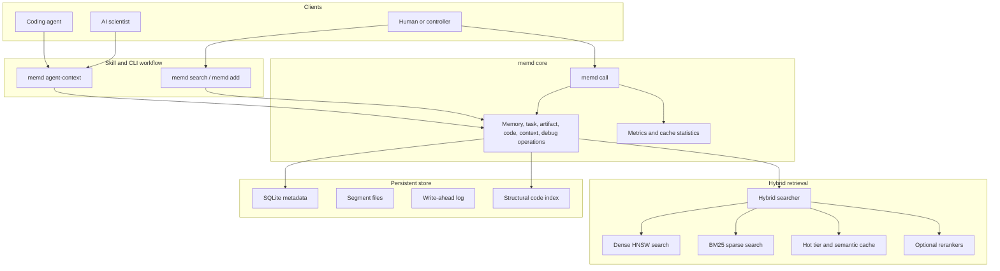

# memd

[](CHANGELOG.md)
[](Cargo.toml)
[](LICENSE)
[](https://fmschulz.github.io/memd/)

`memd` is a local memory CLI that gives coding agents and AI scientists a
single shared, persistent memory — raw searchable content, structured task
history, and canonical collaboration artifacts — indexed by a hybrid dense +
sparse retrieval stack and gated by an explicit trust boundary.

Agents retrieve bounded context with `memd agent-context` or `memd search`,
read the generated context file, and record durable progress with `memd add`.
For low-latency local use, `memd` keeps the store and indexes hot through a
private CLI-managed warm worker driven by ordinary CLI commands.

**Full documentation: [fmschulz.github.io/memd](https://fmschulz.github.io/memd/)**

## What it does

| Surface | Purpose | Primary CLI commands |
| --- | --- | --- |
| Raw memory | Store and search chunks: code, docs, notes, traces, decisions | `memd add`, `memd search`, `memd get`, `memd stats` |
| Agent context | Bounded pre-work context + JSON audit logs | `memd agent-context --output .memd/context.md` |
| Warm CLI | Keep store/index state hot for repeated local calls | `memd warm start`, `memd warm status` |
| Batch CLI | Many structured operations in one loaded process | `memd batch --jsonl requests.jsonl` |
| Export/import | Move local memory to portable formats | `memd export-omf`, `memd import-omf` |
| Operations | Structured memory/task/artifact/context/code/debug ops | `memd call task.start --json '{…}'` |
| Guardrails | Pin tenant/project scope and verify CLI-first agent wiring | `memd init`, `memd doctor` |

Use `memd search --mode brief-project|resume-task|find-failures|find-decisions|find-evidence|find-highlights`
when retrieval should bias toward persisted digests and canonical summaries.
Use `--compact` and `--token-budget` to keep agent context small.

## 30-second quickstart

```bash
# Build
cargo build --release

# Store a memory
./target/release/memd add \
  --tenant-id quickstart --project-id auth \
  --chunk-type summary --tags kind:note \
  --text "parseConfig reads TOML and validates required auth fields"

# Search
./target/release/memd search \
  --tenant-id quickstart --project-id auth \
  --query "auth config validation" --compact --token-budget 2000

# Build bounded context for an agent
./target/release/memd agent-context \
  --tenant-id quickstart --project-id auth \
  --query "auth config validation prior work" \
  --k 2 --token-budget 700 --output .memd/context.md
```

Full walkthrough: [Quick start](https://fmschulz.github.io/memd/quickstart/).

## Architecture



More: [Architecture](https://fmschulz.github.io/memd/architecture/),
[Trust boundary](https://fmschulz.github.io/memd/trust-boundary/),
[Data layout](https://fmschulz.github.io/memd/data-layout/).

## Headline benchmark

Cross-system retrieval on upstream
[`locomo10.json`](https://github.com/snap-stanford/locomo) (10 conversations,
5,882 turns, 1,536 queries, MRR@10 over categories 1–4):

| System | MRR@10 | Hit@10 | Avg search | Seed |
|---|---:|---:|---:|---:|
| **`memd` v0.50.0** | **0.420** | **0.621** | **26.7 ms** | 108 s |
| `superlocalmemory` v3.4.46 (lexical) | 0.369 | 0.599 | 804.5 ms | 1.8 s |
| `mem0` v2.0.2 (LLM-extracted) | 0.354 | 0.591 | 40.9 ms | 13,424 s |

`memd` wins on quality (+14% MRR@10 vs SuperLocalMemory, +19% vs Mem0) and
on search latency. Internal task-memory benchmark (cli_warm: Hit@3 1.00,
MRR 0.87, 9.7 ms), Bright-Pro biology adapter, multi-turn token benchmark,
and reproducibility notes are documented at
[Benchmarking](https://fmschulz.github.io/memd/benchmarking/).

## Agent skill

The agent skill is the default way to make agents use `memd` correctly. It
ships with a bundled Linux binary kept in sync with releases by GitHub
Actions.

```bash
./memd-skill/install_memd_enforcement.sh --install-binary
```

The installer copies the bundled binary into `~/.local/bin/memd`, upserts
CLI-first instruction blocks into `~/.codex/AGENTS.md` and
`~/.claude/CLAUDE.md`, writes the matching Cursor rule to
`~/.cursor/rules/memd.mdc`, and wires a Claude Code `SessionStart` hook in
`~/.claude/settings.json`. It also injects a pre-refusal rule: agents must
check `memd` before declaring a task impossible, blocked, or unknowable.

On older enterprise or HPC Linux hosts, the bundled binary may fail with a
`GLIBC_... not found` error. In that case, build `memd` locally with
`cargo build --release -p memd`, install `target/release/memd` into
`~/.local/bin/memd`, and run `./memd-skill/install_memd_enforcement.sh`
without `--install-binary` so the working host-built binary is not replaced.

Run `memd doctor` after installation to verify the binary, data directory,
global rules, SessionStart hook, and current project scope.

More: [Agent skill](https://fmschulz.github.io/memd/agent-skill/),
[Self-improvement loop](https://fmschulz.github.io/memd/self-improvement/).

## Compiled wiki

[`tools/wiki/`](tools/wiki) ships `memd-wiki`, a Python console script that
compiles a Karpathy-style markdown wiki from live `memd` project state
(`index.md`, `log.md`, `projects/<project_id>.md`,
`tasks/<task_id>.md`, `libraries/{failures,decisions,evidence,highlights}.md`).
Pages are trust-aware: they display `trust_tier`, `requires_verification`,
and `grounded_by` links.

```bash
pip install -e tools/wiki/
memd-wiki build
memd-wiki serve
```

More: [Compiled wiki](https://fmschulz.github.io/memd/compiled-wiki/).

## More

- [Quick start](https://fmschulz.github.io/memd/quickstart/)
- [CLI reference](https://fmschulz.github.io/memd/cli-reference/)
- [Configuration](https://fmschulz.github.io/memd/configuration/)
- [OMF — Open Memory Format](https://fmschulz.github.io/memd/omf/)
- [Task-memory schema](https://fmschulz.github.io/memd/scientific-task-memory/schema/)
- [Changelog](CHANGELOG.md)
