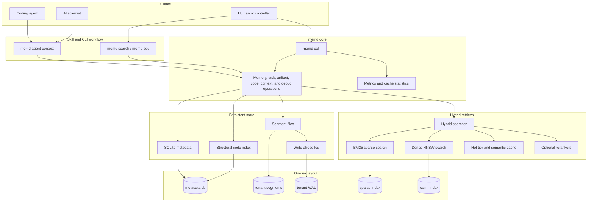

# Architecture

`memd` is a single Rust binary that owns local storage, hybrid retrieval, and a
shared operation surface used by direct CLI commands, `memd call`, and the
warm/batch execution modes.

The runtime stack is designed so direct CLI commands and local operation calls
share the same storage, retrieval, and artifact machinery. SQLite is accessed
through a bounded connection pool under WAL-mode locking, and HNSW rebuilds
swap atomically without blocking readers.

## Hybrid retrieval lanes

| Lane | Role | Notes |
| --- | --- | --- |
| Dense (HNSW) | semantic recall | `mapping.bin` (bincode-packed), graph dump optional |
| Sparse (BM25) | lexical recall | tantivy index, `open_or_create` |
| Hot tier | recency boost | bounded LRU on top of segment store |
| Semantic cache | repeat-query short-circuit | TTL-bounded, query-hash keyed |
| Optional reranker | precision lift | feature-based by default; ONNX cross-encoder and MemReranker-4B opt-in |

See [Optional rerankers](reranking.md) for the cross-encoder and MemReranker-4B
paths, [Data layout](data-layout.md) for on-disk structure, and
[Trust boundary](trust-boundary.md) for what each surface's results commit to.
