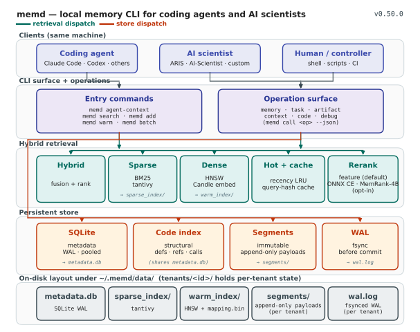
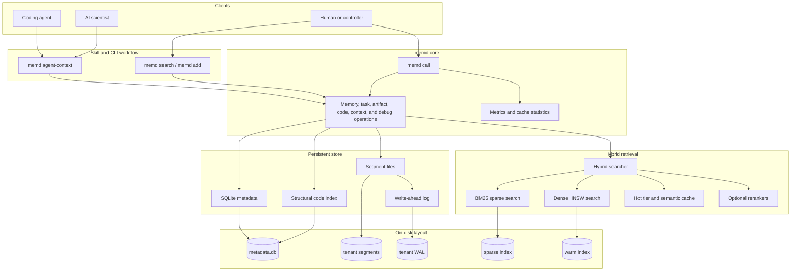

# Architecture

`memd` is a single Rust binary that owns local storage, hybrid retrieval, and a
shared operation surface used by the direct CLI commands, `memd call`, and the
warm/batch execution modes.



The figure shows five layers: clients (same machine), the CLI surface plus the
typed operation surface, hybrid retrieval, the persistent store, and the
on-disk layout. The same layers are sketched below as Mermaid for environments
without SVG.



The runtime stack is designed so direct CLI commands and local operation calls
share the same storage, retrieval, and artifact machinery. SQLite is accessed
through a bounded connection pool under WAL-mode locking, and HNSW rebuilds
swap atomically without blocking readers.

## Layers

### Clients

One trusted machine; multiple agent processes. Coding agents (Claude Code,
Codex, others) and AI-scientist workflows speak to `memd` through ordinary
shell commands. Humans and scripts use the same CLI. No special transport is
required: the binary is the API.

### CLI surface and operations

Two surfaces, one shared dispatcher.

- **Entry commands.** `memd agent-context` builds a bounded pre-work context
  file with a JSON audit log; `memd search` and `memd add` are the workhorse
  retrieve/write pair; `memd warm start|status` keeps the store and indexes
  hot across calls; `memd batch --jsonl` streams structured operations
  through a single loaded process.
- **Operation surface.** `memd call <op> --json '{…}'` and the typed CLI
  subcommands dispatch to the same handlers: `memory`, `task`, `artifact`,
  `context`, `code`, and `debug`. `memory.*` is intentionally flexible
  (chunks, code, docs, traces); `task.*` and `artifact.*` are stricter and
  preserve the recoverable structure of work.

### Hybrid retrieval

| Lane | Role | Notes |
| --- | --- | --- |
| Dense (HNSW) | semantic recall | `mapping.bin` (bincode-packed), graph dump optional |
| Sparse (BM25) | lexical recall | tantivy index, `open_or_create` |
| Hot tier | recency boost | bounded LRU on top of segment store |
| Semantic cache | repeat-query short-circuit | TTL-bounded, query-hash keyed |
| Optional reranker | precision lift | feature-based by default; ONNX cross-encoder and MemReranker-4B opt-in |

Dense and sparse run in parallel; the hybrid searcher fuses their results.
Hot tier and semantic cache short-circuit recency-biased and repeat-shape
queries. Rerankers are off the quickstart path — the built-in feature
reranker handles ordinary agent traffic. See
[Optional rerankers](reranking.md) for the cross-encoder and MemReranker-4B
paths.

### Persistent store

- **SQLite metadata** under WAL-mode locking with a bounded connection pool
  (`MEMD_SQLITE_POOL_MAX`). Pooled WAL gives concurrent readers without
  starving writers.
- **Immutable segments** per tenant. Append-only payload files; deletion is
  logical (tombstones) until maintenance compacts.
- **Per-tenant WAL** (`wal.log`) fsynced before commit. Crash recovery
  replays WAL into segments.
- **Structural code index** sits next to the metadata DB and serves
  `code.*` definitions, references, callers, and imports without going
  through the hybrid retriever.

### On-disk layout

See [Data layout](data-layout.md) for the full tree. The short version:

```
~/.memd/data/
├── metadata.db
├── sparse_index/
└── tenants/<tenant_id>/
    ├── wal.log
    ├── segments/
    └── warm_index/
```

## Trust boundary

Search and digest helpers return **candidates**. Canonical non-digest task
and artifact records are the trust anchor. Persisted digests (project briefs,
failure/decision/evidence libraries) are compiled hints, not authority.
Promotion to `verified_record` requires an independent reviewer with a
distinct `agent_id` submitting a verification — single-writer self-promotion
is rejected. See [Trust boundary](trust-boundary.md) for the rules and
[Comparison with other memory tools](comparison.md) for how this contrasts
with implicit-trust designs.

## Why this shape

Three design choices fall out of the layers above.

1. **No LLM in the write path.** `memory.add` stores chunks and structured
   records directly; `task.*` and `artifact.*` capture the lifecycle without
   running an extractor. The LLM, if any, is in the agent loop, not in the
   store. This keeps seed cost low and decouples write quality from
   extractor-model quality.
2. **Hybrid retrieval, not vector-only.** Dense alone misses identifiers,
   error strings, paths, and ticket IDs. Sparse alone misses paraphrase.
   Both lanes run; results are fused.
3. **Trust is a first-class object.** Most memory systems return what they
   retrieve and trust the caller to decide. `memd` separates retrieval
   candidates from canonical artifacts, marks digests as compiled hints,
   and requires distinct-writer verification before anything is labelled
   verified. The compiled wiki and digest libraries are useful precisely
   because they cannot become ungrounded authority.
