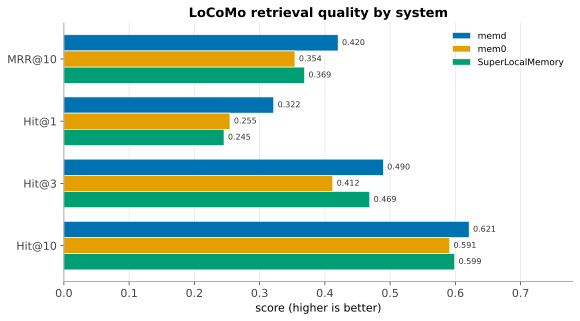
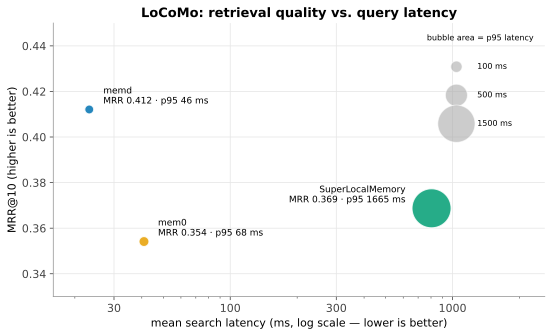
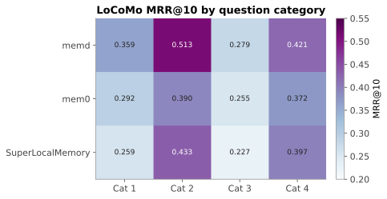
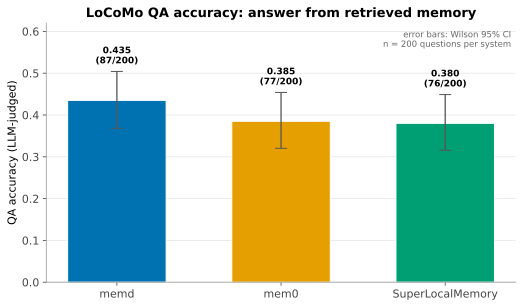
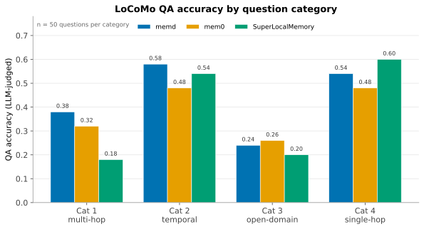
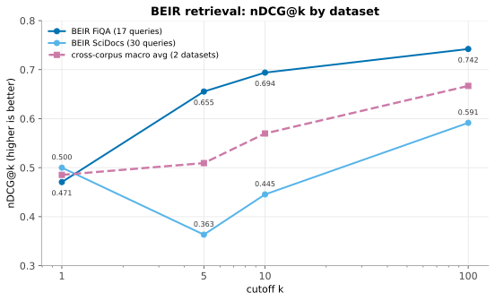
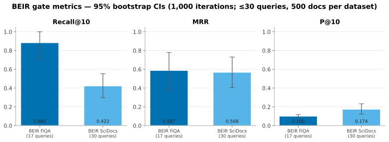
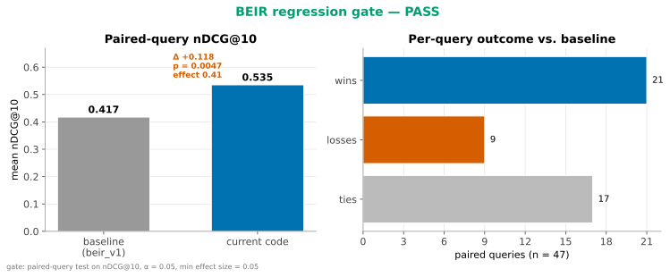

# Benchmarking

`memd` ships several benchmark families. They exercise different parts of the
system, so their numbers should not be mixed without the workload context.
The cross-system [LoCoMo retrieval](#cross-system-retrieval-locomo) result
is the public headline; the [BEIR offline gate](#offline-retrieval-gate-beir)
is the per-PR regression tripwire; the others are internal-corpus or scoped
checks.

## Quick runs

```bash
# Cross-system LoCoMo retrieval (memd vs mem0 vs SuperLocalMemory)
./evals/benchmarks/locomo/run.sh

# Task-memory benchmark (internal corpus)
./evals/bench/scripts/run_task_memory_benchmark.sh

# Offline retrieval benchmark (BEIR fiqa + scidocs)
./evals/bench/scripts/run_offline_retrieval_benchmark.sh

# Regenerate the figures on this page from the checked-in result snapshots
bash evals/notebooks/run_notebooks.sh
```

The figures below are produced by the notebooks in
[`evals/notebooks/`](https://github.com/fmschulz/memd/tree/main/evals/notebooks)
(`locomo_cross_system.ipynb`, `beir_retrieval_gate.ipynb`,
`locomo_qa_accuracy.ipynb`), which read the checked-in JSON snapshots under
`evals/notebooks/data/` and render to `docs/figures/`. Re-running them after a
fresh benchmark refreshes every plot.

## Task memory (internal corpus)

Recommended local execution modes:

| Lane | Retrieval setup | Hit@3 | MRR | Avg search latency |
| --- | --- | ---: | ---: | ---: |
| `cli_warm` | private warm worker | 1.00 | 0.87 | 9.7 ms |
| `cli_batch` | streaming JSONL in one loaded process | 1.00 | 0.87 | 0.6 ms |

The same report includes a flattened chunk baseline with `hit@3 = 1.00`,
`MRR = 0.98`. The structured mode writes more retrieval projections, but
warm and batch execution keep interactive retrieval latency low. The raw
benchmark artifact also retains a startup-overhead diagnostic lane for
reproducibility; the public summary focuses on the two modes agents
should normally use.

Full report: [Task-memory benchmark report](scientific-task-memory/benchmark-results/README.md).

## Bright-Pro scoped adapter (biology q5/d141)

| Method | alpha-nDCG@25 | Recall@25 | Search time |
| --- | ---: | ---: | ---: |
| BM25 subset | 0.77393 | 0.81111 | not separately timed |
| SuperLocalMemory Mode A | 0.78406 | 0.85333 | 31.713 s total, 6.343 s/query |
| `memd` first search | 0.87035 | 0.98000 | 42.521 s total, 8.504 s/query |
| `memd` repeat search | 0.87035 | 0.98000 | 33.260 s total, 6.652 s/query |
| `memd` + MemReranker-4B | 0.90409 | 1.00000 | +92.987 s rerank |

The Bright-Pro result is a scoped gold-plus-decoy adapter check, not a
full-corpus benchmark. It uses 5 biology queries, 41 gold documents, and 100
decoys. Repeat search is the fairer retrieval-speed number because it
excludes fresh indexing and reuses the already-built store.

## Multi-turn agent benchmark

| Interface | Main purpose | Result summary |
| --- | --- | --- |
| `agent-context` prefetch | bounded context before the agent starts | retrieved 10/10 expected priors in the full-suite CLI-prefetch run |
| CLI search | retrieval by shell command during the solve | strongest token condition in the interface comparison, but slower for agents |
| Warm and batch execution | reduce local retrieval overhead | preserve retrieval quality while avoiding repeated startup costs |

## Raw artifacts

- [Task-memory report](scientific-task-memory/benchmark-results/README.md)
- [Bright-Pro adapter](https://github.com/fmschulz/memd/tree/main/evals/bench/bright-pro-memd)
- [Multi-turn token benchmark](https://github.com/fmschulz/memd/tree/main/evals/bench/memd-multiturn-token-savings)

## Cross-system retrieval (LoCoMo)

Direct retrieval benchmark on upstream
[`locomo10.json`](https://github.com/snap-stanford/locomo): each system is
seeded with the same conversation turns and scored against LoCoMo
evidence IDs (MRR@10 over categories 1–4: 10 conversations, 5,882 turns,
1,536 queries).

| System | MRR@10 | Hit@1 | Hit@3 | Hit@10 | Avg search | Seed |
|---|---:|---:|---:|---:|---:|---:|
| **`memd` (hybrid)** | **0.412** | **0.312** | **0.484** | **0.613** | **23.2 ms** | 197 s |
| `superlocalmemory` v3.4.46 (lexical) | 0.369 | 0.245 | 0.469 | 0.599 | 804.5 ms | 1.8 s |
| `mem0` v2.0.2 (LLM-extracted) | 0.354 | 0.255 | 0.412 | 0.591 | 40.9 ms | 13,424 s |

`memd` leads on MRR@10 (+12% vs SuperLocalMemory, +16% vs Mem0), Hit@10, and
search latency. Seeding cost trades off against
quality — SuperLocalMemory has the cheapest seed (no embeddings in this
configuration), Mem0 the most expensive (LLM extraction).



The two axes that matter operationally are quality and query latency. `memd`
sits in the best corner of both — highest MRR@10 at the lowest latency —
while SuperLocalMemory's lexical fallback is roughly 30× slower per query
(bubble area is p95 search latency):



### Per-category

`memd` wins all four LoCoMo categories.

| Category | Description | `memd` | `mem0` | `slm` |
|---|---|---:|---:|---:|
| 1 | multi-hop | **0.353** | 0.292 | 0.259 |
| 2 | temporal | **0.501** | 0.390 | 0.433 |
| 3 | open-domain | **0.275** | 0.255 | 0.227 |
| 4 | single-hop | **0.413** | 0.372 | 0.397 |



### Three design philosophies

- **`memd`** — chunk-native dense + sparse hybrid retrieval. No LLM
  extraction during seed, no LLM rerank during search.
- **`mem0`** — LLM-extracts memory units from raw turns (here using a
  local vLLM `gemma4-31b` endpoint), then vector-searches over the
  extracted memories.
- **`superlocalmemory`** — atomic-fact graph with Fisher-Rao retrieval.
  Reported here in the lexical-only fallback because the published
  Mode A 74.8% MRR@10 number was not reproducible in our workspace; SLM's
  subprocess embedding-worker singleton deadlocked under the LoCoMo
  workload. The lexical result (0.369) does match prior independent
  fallback runs in this workspace (0.368), so the configuration itself
  is reproducible.

### Reproducibility

The self-contained harness is in-repo at
[`evals/benchmarks/locomo/`](https://github.com/fmschulz/memd/tree/main/evals/benchmarks/locomo):
`./run.sh` fetches the dataset, builds `memd`, runs the `memd` adapter, and
attempts the optional `mem0` and SuperLocalMemory adapters when their Python
venvs are present under `evals/benchmarks/locomo/envs/`. The numbers above are
the `2026-06-11` re-run of the `memd` adapter on the current code (after the
H1/H2 fetch-depth fixes), with the `mem0` and SuperLocalMemory numbers frozen
from the `2026-05-22` run (their retrieval was not re-measured). The fixes moved
`memd` MRR@10 from 0.420 to 0.412; it still leads both competitors and wins all
four categories. Seed time is a single-run, machine-load-dependent figure.

Same-LLM caveat: `mem0` numbers above use a self-hosted vLLM
`gemma4-31b` endpoint, not the GPT-4-class model the upstream Mem0
README benchmarks against. Numbers are directly comparable across
the three systems in this table but not directly comparable to the
upstream Mem0 leaderboard.

## LoCoMo QA accuracy (answer quality)

Retrieval MRR scores whether the gold evidence ranks high. It does not score
whether the memory a system retrieves actually lets an agent answer the
question. We added that harder test. For each LoCoMo question we pass the
system's own top-10 retrieved turns to a Codex model, generate a short answer,
and have a second Codex call judge that answer against the gold answer. This is
the answer-accuracy metric the Mem0 and Zep papers report. We ran a stratified
sample of 50 questions per category (200 per system, seed 42) over categories
1–4 and excluded the adversarial category 5. Each accuracy carries a Wilson 95%
interval.

memd answers 43.5% of questions correctly (87/200), ahead of mem0 (38.5%,
77/200) and SuperLocalMemory (38.0%, 76/200). The ranking matches the retrieval
result: the systems that rank evidence higher also answer more questions. At 200
questions the Wilson intervals overlap (memd 0.368–0.504, mem0 0.320–0.454, SLM
0.316–0.449), so we read the QA gap as corroborating the retrieval ranking
rather than as a separately significant result. The full-set retrieval numbers
above carry the stronger claim.



The category breakdown is mixed. memd leads multi-hop questions (category 1,
0.38) and temporal questions (category 2, 0.58); SuperLocalMemory answers more
single-hop long-form questions (category 4, 0.60 vs 0.54); the small open-domain
set (category 3, 92 questions in the full dataset) is hard for every system and
separates them least.



Reproduce: the QA harness runs in an external benchmark workspace, kept out of
this repository because it reuses frozen multi-system retrieval and the large
competing-tool environments. It reads each system's archived top-k retrieved
turn IDs, resolves them to conversation turns, and drives Codex for answer
generation and judging. Re-seeding the competing tools is impractical: mem0
seeding alone took 3.7 h of LLM extraction. We therefore apply the same QA
layer to the retrieval each system already produced. The compact aggregate
snapshot for regenerating the QA figures is checked in at
`evals/notebooks/data/locomo_qa_accuracy_2026-06-11.json`.

## Offline retrieval gate (BEIR)

The internal regression gate runs hybrid retrieval (all-MiniLM dense + BM25
sparse + feature reranker) on BEIR FiQA and SciDocs, capped at 30 queries and
500 documents per dataset (seed 42, 1,000 bootstrap iterations). This is the
exact configuration the CI
[`retrieval-gate`](https://github.com/fmschulz/memd/blob/main/.github/workflows/retrieval-gate.yml)
workflow enforces on every PR, so it is a fast tripwire rather than a precise
leaderboard — the wide confidence intervals below are a direct consequence of
the 30-query cap.

| Dataset | nDCG@10 | Recall@10 | MRR | P@10 | Queries |
|---|---:|---:|---:|---:|---:|
| BEIR FiQA | 0.694 | 0.882 | 0.587 | 0.100 | 17 |
| BEIR SciDocs | 0.445 | 0.422 | 0.568 | 0.174 | 30 |
| cross-corpus (macro avg) | 0.570 | 0.652 | 0.577 | 0.137 | — |





The gate compares the current code against the checked-in `beir_v1.json`
baseline with a paired-query test on nDCG@10. The current code clears the
baseline with a statistically significant improvement (the v0.60/0.61
memory-quality work lifts mean nDCG@10 from 0.417 to 0.535, p = 0.005, effect
size 0.41, 21 wins / 9 losses / 17 ties over 47 paired queries):


