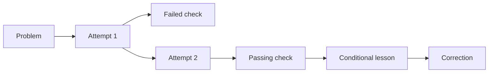

# Experience memory

An experience case connects a problem to attempted repairs and their check
results. A supported lesson states where the repair applies. Cases use
memd's canonical task-artifact store and give later sessions a concise account
to inspect. Repository files hold source code, full logs, plans, and handoffs.

The experience commands require a source build from `main`. The published
1.7.1 release does not contain them. See the
[worked procedure](experience-how-to.md) and [CLI reference](cli-reference.md#experience).

## A case preserves the reasoning trail

Each attempt names its problem and preceding attempt. A check names the exact
attempt it tested. A lesson names a supporting check and states its symptom
terms, machine, tool, and version constraints. A correction supersedes a
lesson without deleting the earlier record. Competing corrections remain
visible as a conflict; recall does not choose between applicable conflicting
lessons.

`experience get` preserves failed checks in history. The general `task.resume`
view takes current blockers and follow-ups from the latest task-state snapshot,
using observation time when available. An old failure remains inspectable
without becoming a current blocker again.

## Provenance belongs to the caller

Before dispatching to a warm worker, the CLI captures the calling directory,
host, Git revision and dirty state, and available native session, thread,
harness, and reported model fields. Missing values stay absent. It does
not infer a model from a default configuration or read a transcript to discover
identity. Native session IDs remain distinct from semantic task IDs.

The optional native session-start adapter can also return agent and parent IDs
from its hook payload. Those fields are not automatically bound to later CLI
writes. Pass a repository evidence link in `provenance.path`, `uri`, `repo`,
or `commit`; CLI enrichment preserves these fields while setting
`provenance.execution` from the current caller.

Search episodes carry the requesting thread even when several sessions share
one warm worker. Structured writes carry execution context in
`provenance.execution`. Check receipts also carry their execution context and,
where available, a digest of the tracked Git diff. Environment values and hook
payloads report identity; they do not authenticate it.

## What a check proves

`experience check` runs the explicitly supplied program in the requesting
CLI process. The worker stores the receipt. The receipt includes argv, working
directory, start and finish times, exit code, timeout status, output hashes,
and source fingerprints. Standard output and standard error are hashed as
streams; their text is not stored. Arguments and paths are stored, so secrets
must not appear in them.

A receipt supports a lesson only when the command exits successfully, both
output hashes are complete, and the before/after source fingerprints are
present and equal. Without explicit evidence paths, the fingerprint covers
the Git revision and tracked diff. Untracked files require `--evidence`;
explicit evidence covers only the named files. A successful command with
unknown or changed source receives `source_unverified` status.
Matching snapshots do not detect a change that was made and reverted between
them.

The receipt establishes the recorded process result and stability of the
covered source. Whether the check was sufficient, and whether its result
supports the guidance, still requires judgment. The lower-level
`experience.record_check` operation
accepts caller-reported historical receipts. Imports preserve those reports
without rerunning checks. Experience artifacts remain `Canonical`, and never
gain `VerifiedRecord` trust merely because a receipt says `passed`.

The command deadline includes process completion and output collection.
On Unix, timeout and handled interruption terminate the verifier's process
group. A descendant that deliberately leaves that group, or a client killed
with `SIGKILL`, is outside that cleanup guarantee. This executor is not a
sandbox.

## Recall checks applicability before returning guidance

`experience find` searches current lessons in the requested tenant and project.
Symptom matching uses lexical overlap after removing common words. Machine,
tool, and version conditions use exact string equality. The CLI defaults the
target machine to its own hostname; a missing required tool or version causes
an explicit abstention. Unspecified lesson conditions impose no restriction.

Lessons from another project require both `visibility: "shared"` on the
lesson and `--include-shared` on the query. Tenant boundaries still apply.
Recall returns `matches`, or `abstain` with `no_match`,
`unknown_required_condition`, or `conflict`. It does not run stored commands.
Ordinary hybrid `search` can still return projected case text as a candidate;
use `experience find` when applicability and correction handling are required.

## Reuse and success are separate observations

The passive Codex outcome scanner records `observed_used` when it recognizes a
retrieved item in a later tool action. That observation carries no success
credit and does not improve retrieval ranking. It uses the action's recorded
time and avoids counting the same action again when a transcript grows.
Recognizable legacy scanner acceptances remain in history but are excluded
from outcome priors.

An explicit task outcome can still name the memories that affected a verified
result. The quality of that attribution depends on the caller's evidence.
Retrieval counts, reuse counts, and successful checks answer different
questions; none alone establishes that memory improved an agent's work.

## Case transfer

The versioned `memd-experience` bundle preserves canonical artifact IDs,
timestamps, provenance, attempts, checks, lessons, and corrections. Import
validates the causal history, scope, envelope, and collisions before writing.
An exact replay inserts nothing. Search projections are regenerated and may
have different chunk IDs; retrieval episodes and outcome events are not part
of this bundle. OMF remains the separate interchange for raw memory chunks.

Import does not retarget tenants or projects, execute argv, authenticate the
origin, or promote trust. A storage failure during a multi-artifact import may
leave a partial import; replaying the same bundle resumes it. Keep a local
store on each machine and transfer bundles explicitly. Continuous replication
and automatic merge of divergent histories are not implemented.

The [validation notebook](https://github.com/fmschulz/memd/blob/main/evals/bench/experience-memory/validation.ipynb)
records execution of deterministic cases, real CLI commands, and transfer
between two stores on one machine. Those checks establish the tested
behaviors, not an improvement in open-ended agent accuracy or latency.
