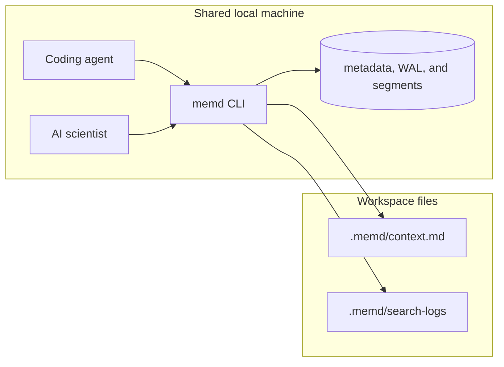

# Shared topology

The recommended deployment is **one shared local data directory per trusted
machine or trust domain**, with multiple coding-agent and AI-scientist
sessions using the same `memd` CLI binary and tenant/project conventions.



## Single writer, many readers

The warm worker is the normal writer. It opens `<data_dir>/.writer.lock` with
an exclusive `flock`, records its pid and start time in the lock file for
diagnostics, and holds the flock for its whole lifetime. The flock releases
when the process dies; there is no stale-lock garbage collector.

Read and write commands use `--warm <auto|off|required>` where supported
(`add`, `search`, `agent-context`, `delete`, `import-omf`, `purge`,
`consolidate`, `batch`, `report`, and `call`). `--warm auto` is the default:
use the local worker, starting it if needed, and fall back to the cold CLI path
if startup or connection fails. `--warm off` always runs in the current CLI
process. `--warm required` requires a local worker and fails if one cannot be
started or reached.

Warm-routable commands are `search` without `--include-superseded`,
`agent-context`, `report`, `call`, `add`, `delete`, `import-omf`, `purge`,
`consolidate`, and `batch` without `--stream`. Cold-only variants such as
`search --include-superseded` and `batch --stream` silently run locally with
`--warm auto`, but hard-error with `--warm required`:
`<variant> always runs on the cold path and cannot be routed through the warm worker; re-run with --warm auto for silent local fallback or --warm off`.

Direct writes (`--warm off`, or `--warm auto` after worker startup fails) take
the same exclusive flock with a bounded retry budget. The default total retry
budget is 10 s and can be changed with `MEMD_WRITER_LOCK_TIMEOUT_MS`. On
contention, the typed error is:

```text
writer lock held by another process ({holder}) at {lock_path}; if a memd warm worker is running, route this write through it (--warm auto, the default) or stop it with `memd warm stop`; otherwise stop the other memd process or retry later (MEMD_WRITER_LOCK_TIMEOUT_MS)
```

Reads are lock-free. Read commands open the store in ReadOnly mode, take no
writer lock, never append WAL records, never write segments, and skip index or
cache persistence. A ReadOnly open of a missing data directory does not create
directories or `metadata.db`; mutating operations on a ReadOnly store return a
typed error.

The worker probes SQLite `data_version` before each request. If an external
direct-fallback mutation happened, it refreshes indexes before serving so
read-your-writes holds across warm and direct-write paths.
Measured on the dev machine (2026-06, hardening validation run): an 8-writer × 3-round
write storm leaves 24/24 concurrent writes readable (7 of 16 were lost in the
2026-06-09 audit before the writer lock); warm-routed `memd add` p50 is 31 ms (vs ~1.6 s cold); a write is
searchable within p95 <70 ms.

`memd maintenance` is not warm-routable. It takes the data-dir writer lock
directly, so stop the worker first with `memd warm stop` or it fails after the
writer-lock timeout. `memd purge` is worker-routed by default, including
`--rewrite-segments` and `--vacuum-metadata`; `memd purge --warm off` takes
the lock directly and also requires the worker to be stopped.

## Boundary conditions

- Same-machine shared sessions through the CLI are the primary supported path.
- `memd` does **not** provide built-in multi-user authentication or account
  isolation.
- `tenant_id` is caller-supplied logical partitioning, **not an authentication
  boundary**. Keep separate trust domains in separate data directories or
  under explicit tenant conventions.
- Prefer one stable shared `tenant_id` per trust domain; use `project_id`,
  `thread_id`, and `task_id` for narrower retrieval scopes.
- Cross-tenant project aliasing is **off by default**. Enable it only when
  consolidating mis-routed history; every widened hit produces a warning log.
- Do not share a live data directory over NFS or other network filesystems;
  `flock` is unreliable there. Move memory across machines with OMF
  export/import instead.

## Scopes in normal use

| Scope | Set via | Use it for |
| --- | --- | --- |
| `tenant_id` | `--tenant-id`, `.memd/tenant_scope.json` | trust domain (one per machine usually) |
| `project_id` | `--project-id`, `.memd/project_scope.json` | repository or workflow boundary |
| `thread_id` | tag `thread:<id>` or per-call argument | conversation or PR scope |
| `task_id` | tag `task:<id>` | one unit of work |

The SessionStart hook can auto-create a minimal `.memd/project_scope.json`
from the default tenant and repo basename. Use `memd init` when you want the
full `.memd/tenant_scope.json`, `.memd/project_scope.json`, and local
guardrail files so subsequent commands can omit the IDs.
