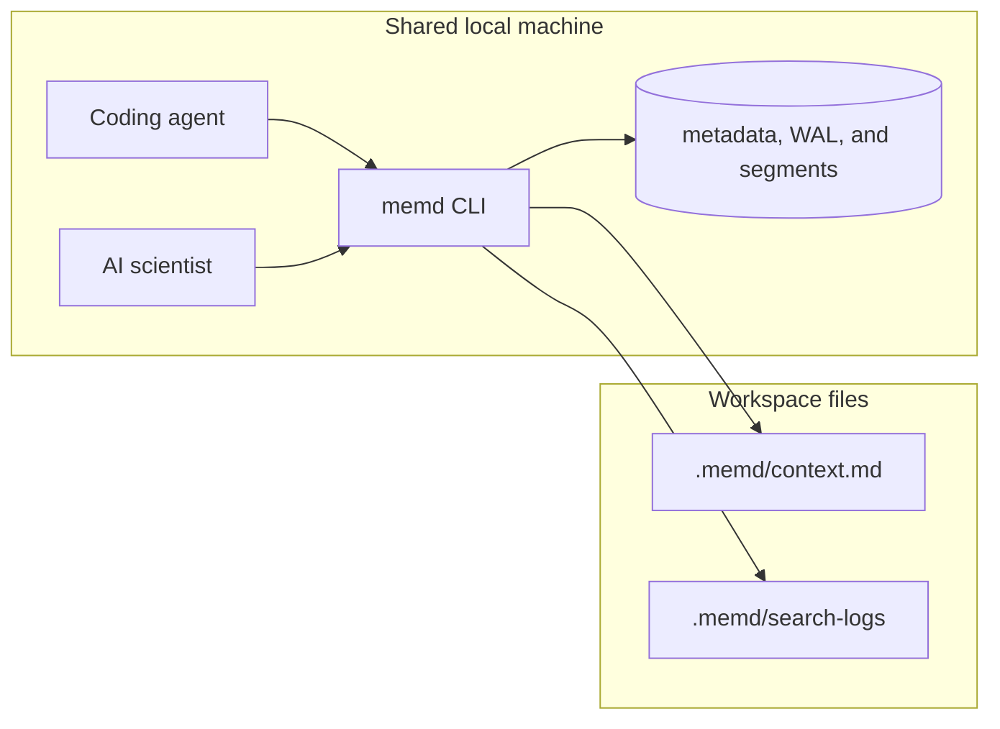

# Shared topology

The recommended deployment is **one shared local data directory per trusted
machine or trust domain**, with multiple coding-agent and AI-scientist
sessions using the same `memd` CLI binary and tenant/project conventions.

## Boundary conditions

- Same-machine shared sessions through the CLI are the primary supported path.
- `memd` does **not** provide built-in multi-user authentication or account
  isolation.
- `tenant_id` is caller-supplied logical partitioning, **not an authentication
  boundary**. Keep separate trust domains in separate data directories or
  under explicit tenant conventions.
- Prefer one stable shared `tenant_id` per trust domain; use `project_id`,
  `thread_id`, and `task_id` for narrower retrieval scopes.
- Cross-tenant project aliasing is **off by default**. Enable it only when
  consolidating mis-routed history; every widened hit produces a warning log.

## Scopes you actually use

| Scope | Set via | Use it for |
| --- | --- | --- |
| `tenant_id` | `--tenant-id`, `.memd/tenant_scope.json` | trust domain (one per machine usually) |
| `project_id` | `--project-id`, `.memd/project_scope.json` | repository or workflow boundary |
| `thread_id` | tag `thread:<id>` or per-call argument | conversation or PR scope |
| `task_id` | tag `task:<id>` | one unit of work |

See [Quick start](quickstart.md#1-build) for `memd init` which writes
`.memd/tenant_scope.json` and `.memd/project_scope.json` so subsequent
commands can omit the IDs.
