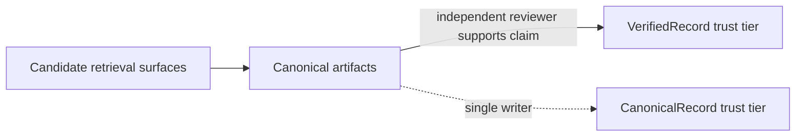

# Trust boundary

`memd` separates retrieval surfaces from canonical artifacts. Search and
digest helpers return **candidates**; only canonical artifacts commit to a
trust tier, and tier promotion requires an independent reviewer.

## Rules

- `memory.search`, `task.search`, `artifact.search`, and digest helpers are
  **candidate-generation surfaces**.
- Canonical non-digest artifacts are the **trust anchor**.
- Persisted digests are **compiled hints**, not self-authenticating truth.
- `artifact.find_related` retrieves canonical artifacts that overlap a claim;
  a retrieval hit is only **supporting evidence**, not trust.
- `VerifiedRecord` trust requires an **independent reviewer with a distinct
  `agent_id`** submitting an `artifact.verification` with `supports_claim =
  true`. A single agent cannot self-label as verified.

## Local security posture

- The warm worker creates its Unix socket in a `0700` runtime directory and
  chmods the socket file to `0600` before accepting connections.
- Embedding model and tokenizer downloads for all-MiniLM-L6-v2 and
  Qwen3-Embedding-0.6B are pinned to immutable Hugging Face commit revisions
  and verified against compiled-in SHA-256 digests.
- Corrupted or tampered embedding model/tokenizer files are rejected and never
  loaded.
- Writes are serialized by an exclusive data-dir writer lock so concurrent
  local agents cannot corrupt the store.

## Failure mode this prevents

An agent that treats a search hit as established fact will repeat an unverified
claim into new work. The boundary forces the commitment to be explicit:
retrieval only nominates candidates, and promotion to VerifiedRecord requires a
second agent with a distinct agent_id to countersign. Downstream consumers
(wiki, paper artifacts) read the tier and decide what to surface.

See the [task memory schema](scientific-task-memory/schema/README.md) for the
full canonical-artifact envelope and how trust tiers are persisted.
