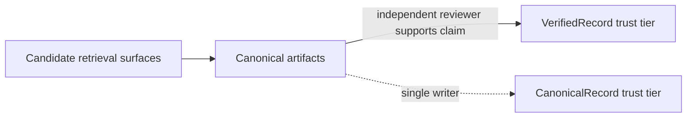

# Trust boundary

`memd` separates retrieval surfaces from canonical artifacts. Search and
digest helpers return **candidates**; only canonical artifacts commit to a
trust tier, and tier promotion requires an independent reviewer.

## Rules

- `memory.search`, `task.search`, `artifact.search`, and digest helpers are
  **candidate-generation surfaces**.
- Canonical non-digest artifacts are the **trust anchor**.
- Persisted digests are **compiled hints**, not self-authenticating truth.
- `artifact.find_related` retrieves canonical artifacts that overlap a claim;
  a retrieval hit is only **supporting evidence**, not trust.
- `VerifiedRecord` trust requires an **independent reviewer with a distinct
  `agent_id`** submitting an `artifact.verification` with `supports_claim =
  true`. A single agent cannot self-label as verified.

## Why this matters

When agents commit to facts based on retrieval alone they can drift on
hallucinated context. The trust boundary makes the commitment explicit:
retrieval is for finding candidates; promotion to `VerifiedRecord` requires
distinct-writer review. Wiki, paper artifacts, and other downstream consumers
read the tier and decide what to surface.

See the [task memory schema](scientific-task-memory/schema/README.md) for the
full canonical-artifact envelope and how trust tiers are persisted.
